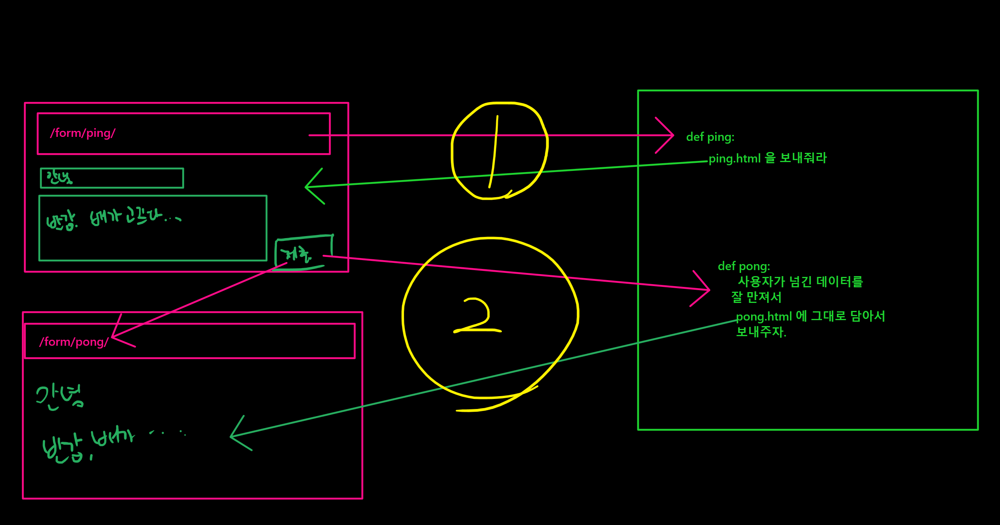
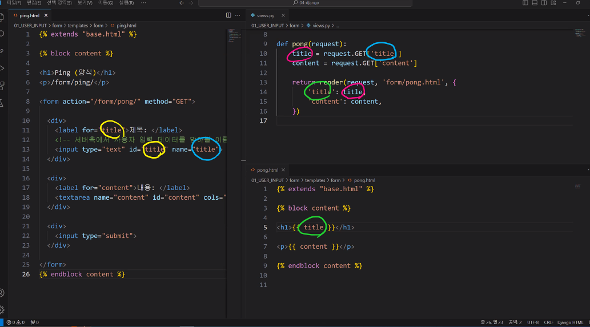

# django
프레임워크는 프랜차이즈처럼느낌 내가 쓰기는 편하지만 제약이 있음
라이브러리는 원하는 것만 꺼내옰수 있어 자유도는 높지만 프레임워크처럼 쉽지는 않음

준비물
vs코드에 Django(Baptiste Darthenay) 설치 

- 앱을 만들면 해야하는 상황에서 해야할 일
  1. touch urls.py : 앱안에 urls 파일만들기
  2. mkdir -p templates/form : 앱안에 templates 폴더와 그안에 form이라는 폴더 하나 더 만들기(-p가 parent로 templates라는 파일이 없어도 같이 만들수 잇음)
  3. cd templates/form으로 이동해 필요한 .html 문서 만들기

## 기본 문법(project : 00_INTRO)
1. django 폴더만들고 `pip install django` 설치
2. 새로운 프로젝트 시작시 `jango-admin startproject intro` git에 작성
  - intro는 총무(master app)고 manage는 집사?
  -  이름이 마음이 안들어도 자동으로 설치된 파일명은 변경 불가능
  - 하지만, 밖에 뜨는 프로젝트명은 변경 가능
3. 마스터 폴더의 settings안의 내용
   - installed_apps를 제일 많이 사용함
   - middleware : 요청이 들어왔을때 정수기 필터 역할을 함
   - templates : html에 대한 내용
   - wsgi_application : wsgi파일안에 application관련내용
   - root_urlcof : 최상단 url 설정 -> urls 파일
   - auth_password_validators = 비밀번호 설정할때 유효한 애들(1234와 같은 비번 못쓰도록)만 쓸수 있도록 설정
   - time_zone : 시간 기준 설정
   - usf_I18n : 국제화
   - LANGUAGE_CODE : 원하는 언어설정(ko-kr)
  - urls 파일에 내용도 잘 보고 설정보기
4. 프로젝트 영업개시위해 프로젝트 폴더(00_INTRO)안에 들어와서 `python manage.py` 실행
5. staticfiles안에있는 runserver사용 `python manage.py runserver` 실행후 하단에 나온 서버링크 클릭
서버를 설치할때 너무 최신은 오히려 독일수 있음. django는 .2버전이 안정적임([로드맵](https://www.djangoproject.com/download/))


## 고정된 url로 app과 master 연동하기(project : 00_INTRO)
app을 master에 포워딩하는 방식   
실습파일 : home, utils, recap
> 연동 순서 
>> master urls <-> app urls <-> app views <-> templates의 html
1. 새로운 앱(app) 시작 : `python manage.py startapp home`
2. intro.settings에 installed_apps에 `home` 등록(출생신고)1. home 폴더안에 url.py 파일 만들기
3. master url 작업
   - `from django.urls import path, include` 가 필요
   - path('home/', include('home.urls')) : home의 url에 연동하기
4. home url 작업
   - `from django.urls import path, include` 필요
   - `from . import views` : 현재 home.urls의 파일이 들어간 폴더내에 views파일을 불러오는 것
   - urlpattersn = [] 는 필수
   - [] 안에 home에서 연동해서 나갈 경로를 새로 지정해주기. 
   - views 뒤에 views안에 있는 함수와 연동하기 위해 views.함수명 작성해주기
5. home views 작업(utils의 views도 참고)
   - `from django.http import HttpResponse` : views 파일에서 바로 보여줄 경우 사용
   - `from django.shortcuts import render` : html의 파일을 불러오기 위해 필수
     - html을 불럭오기 위해서 app 폴더 내에 templates의 폴더를 만들고 여기에 html 파일을 만들기
     - 주의! html의 명이 중복되면 다른 app의 하위 templates에 있는 html을 가져옴    
      -> 왜냐면 master.settings 안에 installed_apps에 app이 등록된 순서대로 먼저 확인함   
      -> 이를 해결하려면 templates안에 새로운 폴더를 생성하고 html 파일을 옮겨줌. 그리고 views에 새로생 성한 `폴더명/파일명.html`로 경로를 설정해주면 됨   
      -> 폴더명은 app명과 통일해 주는게 좋음
   - 새로운 함수 계산이 필요한 경우에 필요 라이브러리는 views 파일에 작성하기
   - 함수를 작성한 경우 render뒤에 딕셔너리로 작성해서 계산 값 넣기
6. 파일명.html 작업
   - 최종 화면에 보여줄 모습을 HTML로 작성해서 보여주기
   - `django Template Language(DTL)` : 원래 {{}}는 html에서는 아무런 효과가 없지만 django에서는 특수문법으로 적용됨
     - {{  }} => print(출력)
     -  => 논리 : if 문 혹은 for문등 논리력으로 작성 


## 고정된 url이 아닌 사용자가 url에 남기는 데이터로 브라우저 조회(project : 01_USER_INPUT)
> url/한승주/ 처럼 사용자가 url 한승주라는 값을 넣었을때 그 값을 활용하는 방식    

실습폴더 : var_routing

1. 마스터 폴더안에 Templates 폴더 생성
2. Templates 폴더 안에 base.html 파일 생성
3. html의 중복된 head값을 base.html에 만들어서 ``를 body 안에 기입
4. 마스터의 settomgs.py에서 TEMPLATES의 DIRS를 `[BASE_DIR/'templates']`로 지정
5. APP안에 Templates의 html파일에서 아래처럼 확장자를 연결하고 내용 집어넣기
   -  : base.html을 확장해서 쓸거야라는 의미 
    ```html
    

    

    내용 집어넣기

    
    ```
6. `<str.name>` : 문자열인 변수가 것

## html간 자료를 주고 받기(project : 01_USER_INPUT)
실습파일: form, utils
> 두개의 html 파일을 만든 뒤 한 브라우저에 사용자가 값을 입력하면 자동으로 다른 브라우저로 연동되어 사용자가 입력한 데이터의 값을 사용해서 보여주는 방식
   <p align="center">
   
   </p>

1. 새로운 앱 생성뒤 master settings에 등록
2. 앱안에 urls.py 생성
3. 생성된 앱에 templates폴더를 만들고 앱이름과 같은 폴더 하나더 생성 
4. 앱 이름과 같은 폴더내에 input.html output.html 문서 만들기
5. master urls 작업  : 기존방식과 동일
6. app urls 작업 : 기존방식과 동일
7. views & html 작업 
   - input.html에 사용한 id의 name을 
   - views.py에 가져와 값으로 사용하기
   - 값으로 사용된 자료 key값을 ouput.html에 사용해 브라우저에 표시
   - id : 브라우저안에서만 사용html과 css에서만 사용
   - name : 서버에서 사용
   > id가 title이면 for의 라벨이 title이 되는것이고 name의 title이 views에서 쓸 key값
<p align="center">

</p>

### 기타 
- `input.html`에서 `type` 설정을 잘해야함. text냐 number에 따라서 사용자가 문자열만 입력할수 숫자만 입력하게 할 수 있음
- `view.py`에 output을 담당하는 함수(def)를 조작하면 input에서 제공한 값을 다양하게 활용할 수 있음
- inpurt에서 내용을 보내면 output에서 request에 내용이 저장됨
- `<form action="/form/pong/" method="">` 여기서 아무말도 쓰지 않으면 기본값 get으로 method가 지정
- `placeholder="안내메세지"` : 입력창안에 안내메세지를 넣을 수 있음
- `required` : 사용자가 공란으로 제출 못하게 막을수 있음(필수사항)
> 주의! : 사용자가 입력한 값은 무조건 문자열로 받음. 그러니 views에서 받은 값의 형변환이 필요함

## 데이터베이스 저장()


