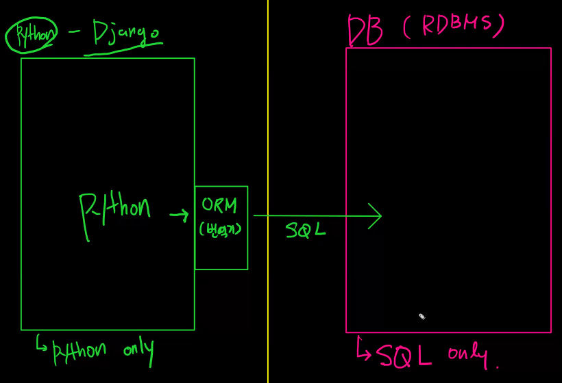
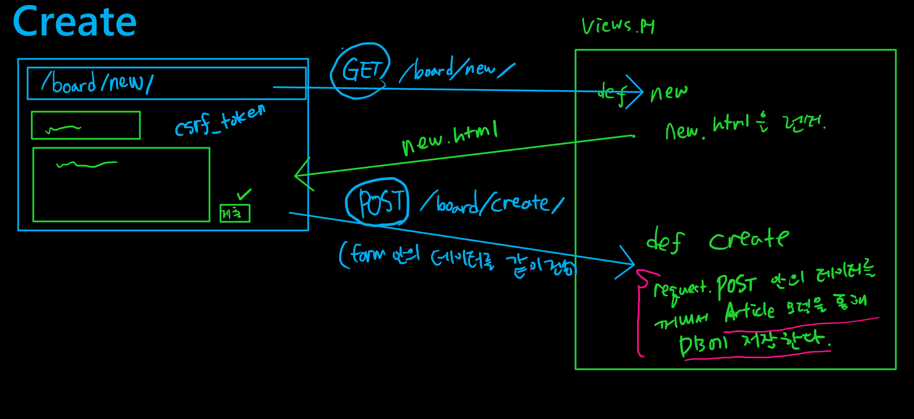
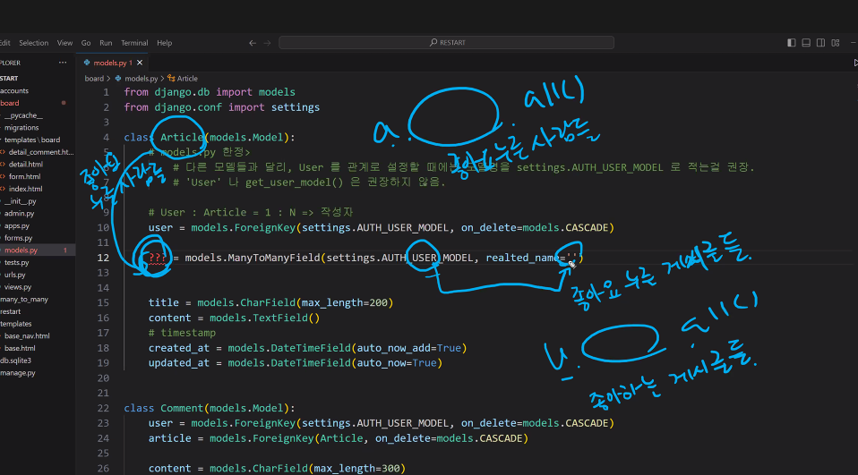
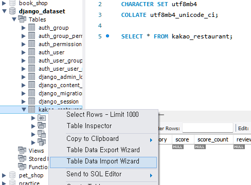

# django
프레임워크는 프랜차이즈처럼느낌 내가 쓰기는 편하지만 제약이 있음
라이브러리는 원하는 것만 꺼내옰수 있어 자유도는 높지만 프레임워크처럼 쉽지는 않음
[튜토리얼](https://docs.djangoproject.com/en/5.0/intro/tutorial03/#namespacing-url-names)

준비물
1. gitbash 설치
   - pip install django : django를 사요하기 위해 필요한것
   - pip install django_extensions : Django 프로젝트에 대한 확장 모듈 모음
     - 대신 settings에 꼭 'django_extension'를 넣어줘야함
2. vs코드 extensions 설치: 
   - Django(Baptiste Darthenay) 
   - SQLite Viewer(Florian Klampfe)

- 앱을 만들면 바로바로 해야할 일
  1. touch urls.py : 앱안에 urls 파일만들기
  2. mkdir -p templates/form : 앱안에 templates 폴더와 그안에 form이라는 폴더 하나 더 만들기(-p가 parent로 templates라는 파일이 없어도 같이 만들수 잇음)
  3. cd templates/form으로 이동해 필요한 .html 문서 만들기

## 기본 문법(project : 00_INTRO)
1. 새로운 프로젝트 시작시 `django-admin startproject <project_name>` git에 작성
   - intro는 총무(master app)고 manage는 집사
   - 이름이 마음이 안들어도 자동으로 설치된 파일명은 변경 불가능
   - 하지만, 밖에 뜨는 프로젝트명은 변경 가능
2. 마스터 폴더의 settings 내용
   - installed_apps를 제일 많이 사용
   - middleware : 요청이 들어왔을때 정수기 필터 역할을 함
   - templates : html문서를 다루는 내용. django가 html문서를 읽을때 항상 templates를 먼저 살펴봄
   - wsgi_application : wsgi파일안에 application관련내용
   - root_urlcof : 최상단 url 설정 -> urls 파일
   - auth_password_validators = 비밀번호 설정할때 유효한 애들(1234와 같은 비번 못쓰도록)만 쓸수 있도록 설정
   - time_zone : 시간 기준 설정
   - usf_I18n : 국제화
   - LANGUAGE_CODE : 원하는 언어설정(ko-kr)
3. 프로젝트 영업개시전 프로젝트 폴더(00_INTRO)안에 들어와서 `python manage.py` 스크립트 뭐가 있는지 보기
4. staticfiles안에있는 runserver사용 `python manage.py runserver` 실행후 하단에 나온 서버링크 클릭   
[참고]서버를 설치할때 너무 최신은 오히려 독일수 있음. django는 .2버전이 안정적임([로드맵](https://www.djangoproject.com/download/))


## 고정된 url로 app과 master 연동하기(project : 00_INTRO)
app을 master에 포워딩하는 방식   
실습파일 : home, utils, recap

> 연동 순서 
>> master urls <-> app urls <-> app views <-> templates의 html
1. 새로운 앱(app) 시작 : `python manage.py startapp <app_name : home>`
2. intro.settings에 installed_apps에 `home` 등록(출생신고)
3. App(home) 폴더안에 url.py 파일 만들기
4. master url 작업
   - `from django.urls import path, include` 가 필요
   - path('home/', include('home.urls')) : home의 url에 연동하기
5. App url 작업
   - `from django.urls import path, include` 필요
   - `from . import views` : 현재 home.urls의 파일이 들어간 폴더내에 views파일을 불러오는 것
   - urlpattersn = [] 는 필수
     - [] 안에 home에서 연동해서 나갈 경로를 새로 지정해주기
   - views 뒤에 views안에 있는 함수와 연동하기 위해 views.함수명 작성해주기
6. App views 작업
   - `from django.http import HttpResponse` : views 파일에서 바로 보여줄 경우 사용
   - `from django.shortcuts import render` : html의 파일을 불러오기 위해 필수
   - html을 불럭오기 위해서 app 폴더 내에 templates의 폴더를 만들고 여기에 html 파일을 만들기
     - 주의! html의 명이 중복되면 다른 app의 하위 templates에 있는 html을 가져옴    
      -> 왜냐면 master.settings 안에 installed_apps에 app이 등록된 순서대로 먼저 확인함   
      -> 이를 해결하려면 templates안에 새로운 폴더를 생성하고 html 파일을 옮겨줌. 그리고 views에 새로 생성한 `폴더명/파일명.html`로 경로를 설정해주면 됨   
      -> 폴더명은 App명과 통일해 주는게 좋음
   - 새로운 함수 계산이 필요한 경우에 필요 라이브러리는 views 파일에 작성하기
   - 함수를 작성한 경우 render뒤에 딕셔너리로 작성해서 계산 값 넣기
     - render 함수의 3번째 인자가 context 라는 이름으로 정의되어 있는데, context는 반드시 dict 만 들어올 수 있도록 만들어져 있기  때문 
     - render 함수 자체의 특성이라 어쩔수가 없음 
7. .html 작업
   - 최종 화면에 보여줄 모습을 .html로 작성해서 보여줌
   - `django Template Language(DTL)` : 원래 {{}}는 html에서는 아무런 효과가 없지만 django에서는 특수문법으로 적용됨
     - {{  }} => print(출력)
     -  => 논리 : if 문 혹은 for문등 논리력으로 작성 


## 고정된 url이 아닌 사용자가 url에 남기는 데이터로 브라우저 조회(project : 01_USER_INPUT)
> url/한승주/ 처럼 사용자가 url 한승주라는 값을 넣었을때 그 값을 활용하는 방식    

실습폴더 : var_routing

1. 마스터 폴더안에 templates 폴더 생성
2. templates 폴더 안에 base.html 파일 생성
3. html의 중복된 head값을 base.html에 만들어서 ``를 body 안에 기입
4. 마스터의 settomgs.py에서 TEMPLATES의 DIRS를 `[BASE_DIR/'templates']`로 지정 
   - 그래야 App안에 말고 Master 안에 있는 templates 파일도 조회함
5. APP안에 Templates의 html파일에서 아래처럼 확장자를 연결하고 내용 집어넣기
   - `` : base.html을 가져와서 쓸거야라는 의미 
  
    ```html
    

    

    내용 집어넣기

    
    ```
- `'greeting/<str:name>/'` : url에서 ~~/한승주/ 처럼 name이란 변수를 문자열로 받겠다라는 의미 

## html간 자료를 주고 받기(project : 01_USER_INPUT)
실습파일: form, utils
> 두개의 html 파일을 활용!   
> 한 브라우저에 사용자가 값을 입력하면 자동으로 다른 브라우저로 연동되어 사용자가 입력한 데이터의 값을 사용해서 보여주는 방식
   <p align="center">
   
   </p>

1. 새로운 앱 생성뒤 master settings에 등록
2. 앱안에 urls.py 생성
3. 생성된 앱에 templates폴더를 만들고 앱이름과 같은 폴더 하나더 생성 
4. 앱 이름과 같은 폴더내에 input.html output.html 문서 만들기
5. master urls 작업 
6. app urls 작업    
-> 여기까진 기존방식과 동일
---
7. views & html 작업 
   - input.html에 사용된 id의 name ->  views.py에서 request.get에 저장
   - views.py에서 값으로 사용된 자료 key ->  ouput.html에 사용해 브라우저에 표시
   - id : 브라우저안에서만 사용html과 css에서만 사용
   - name : 서버에서 사용
   > id가 title이면 for의 라벨이 title이 되는것이고 name의 title이 views에서 쓸 key값
<p align="center">

</p>

### 기타 
- `input.html`에서 `type` 설정을 잘해야함.
  - text냐 number에 따라서 사용자가 문자열만 혹은 숫자만 입력하게 할 수 있음
- `view.py`에 output을 담당하는 함수(def)를 조작하면 input에서 제공한 값을 다양하게 활용할 수 있음
- inpurt에서 내용을 보내면 output에서 request에 내용이 저장됨
- `<form action="/form/pong/" method="">` 여기서 아무말도 쓰지 않으면 기본값 get으로 method가 지정
- `placeholder="안내메세지"` : 입력창안에 안내메세지를 넣을 수 있음
- `required` : 사용자가 공란으로 제출 못하게 막을수 있음(필수사항)
> 주의! : 사용자가 입력한 값은 무조건 문자열로 받음. 그러니 views에서 받은 값의 형변환이 필요함

### 보안
1. method="GET" : 별거 아님. 대충해되 됨. 보안걱정 없음. 별 위험이 없다고 django는 믿고있음   
  vs
2. method="POST" : GET보다는 별거 있고 서버가 바뀔수 있음. 보안 걱정 있음으로 위험이 있다고 django는 믿고 있음
   - 경찰서에 급하게 들어가면 경찰이 자연스럽게 신분증을 요청하는 것처럼 의례 형식? 같음
   - 보안절차(CSRF)
   - input.html의 method를 POST로 바꾸면 views.py에 request.post에 데이터가 저장됨
   - ``을 input.html에 꼭 설정해줘야함

## 데이터베이스 저장(project : 02_MODEL)
실습파일 : hospital
우리가 데이터베이스를 쓰기 시작한 후부터 두가지 세상이 있음.
- python - Django 세계 : python only
- DB(RDBMS) 세계 : sql only
  - ORM(Object-Relational Mapping) : o(객체_파이썬), R(관계지향_sql)   
   번역기 같은 것으로 파이썬으로 작성한 언어가 SQL로 번역됨. 덕분에 장고를 쓸때 SQL언어를 하나도 안쓰고 사용할수 있음
  - 우선 SQLite3로 sql 경량화버전을 사요하지만 나중에 더 높은 수준의 프로그램으로 갈아 끼울수 있음
  
   <p align="center">
   
   </p>

1. 테이블에 대응하는 모델 클래스 생성 작업
   - 새로 생성된 앱의 models.py에 테이블을 그릴 클래스를 생성
2. 컬럼에 대응하는 필드 클래스 변수 설정 작업
   - models.Model클래스는 많은 정보를 가지고 있음
   - charfield의 경우 길이 정보를 확실하게 기입해야함
> 한줄요약 : model.py은 테이블을 정리하기 위해 쓰는것
1. 해당 프로젝트를 runserver하면 db.sqlite가 생성됨
   - db.sqlite가 우리가 만든 테이블이 sql형식으로 세팅되어서 나올 곳
2. `python manage.py makemigrations <app_name>`
   - 테이블을 넘기기 위해서 스캐치를 먼저보기 위한 작업
   - 앱안에 migrations이 생성됨
   - 아직 테이블이아니라서 0001_initial.py로 스캐치를 확인할수 있음
     - id :  환자들을 구분할수 있는 확실한 키를 django가 자동으로 만들어줌
3. `python manage.py migrate <app_name>`
   - 스캐치를 보니 마음에 들어서 이제 테이블로 최종 생성
4. pip install django_extensions 설치후 settings에 'django_extension'를 넣어줌
5. 모든 장소에서 하는 일들은 터미널 즉, manage.py를 통해서 실행됨
   - 파이썬은 직접 실행, 간접실행이 있으며 직접실행의 경우 python manage.py shell_plus를 입력해 터미널에서 직접입력해야만 실행할 수 있음. 
   - 즉, `if __name__ == '__main__':`밑에 적는애들은 runserver로 작동해도 전혀 인지하지 않음

### CRUD( C => R => U => D )
개발자들에게 가장 중요한 개념 네 가지   
유저들의 입력 정보(예를 들면, 로그인 정보, 클릭 정보 등)를 데이터베이스에 추가해서 ‘이 유저는 여성복을 좋아하는구나’처럼 요청한 데이터를 내놓는 것이 Create 개념

1. **Create**(생성)
   - 개발자들이 데이터를 직접 작성하지는 않음. 유저들이 다양한 정보 넣어주는 것
   1. 가장 일반적인 방법    
   각 column값 직접 설정해 행을 채우기
      ```pyhon
      p1 = Patient()
      p1.name = '한한한'
      p1.age = 20
      p1.weight = 67.3
      p1.height = 175.2
      p1.mbti = 'ESFP'
      P1.save()
      ```
   2. 채워서 저장(2STEP)   
   p2 = Patient(name='한환자', age=23, weight=52.3, height=162.0, mbti='ESTP')   
   p2.save()
   3. 한번에 채워서 저장(3STEP)   
   p3 = Patient.objects.create(name='한환자', age=23, weight=52.3, height=162.0, mbti='ESTP')
   - 주의! 1과 3은 꼭 .save()를 해야만 테이블에 저장됨

2. **Read**(조회)
   - CRUD에서 개발자들이 사실상 95%는 조회에 힘을씀
   1. 전체 조회 : Patient.objects.all()
   2. 단일 조회 : p4 = Patient.objects.get(name='연습')
      - 이름/나이 조회 등 다양하게 조회가능 : p4.name, p4.age
   3. 조건 조회 : django의 특수문법
      - 나이가 25 이상인 사람들 : Patient.objects.filter(age__gte=25)
      - 키가 170보다 작은 사람들 : Patient.objects.filter(height__lt=170)
   > 사실 가장 확실하게 데이터를 조회할 수 있는건 **id**로 조회하는것
   > 그러나 파이썬에는 id라는 함수가 있으니 그냥 **pk**라는 말을 사용
   > (예시) p4 = Patient.objects.get(pk=4)

3. **Update**(수정)
   - 한명을 고르고 수정하고 저장하면 끝
   ```python
   p1 = Patient.objects.get(pk=1)
   p1.age =40
   p1.weight += 10
   p1.save()
   ```

4. **Delete**(삭제)
   - 한명을 고르고 삭제하면 끝
   - save 필요없고 되돌릴수도 없음 신중하게 해야함
   - 한번 배정된 id는 삭제되면 두번 다신 못씀. 건너띄고 새로 배정됨
   ```python
   p2 = Patient.objects.get(pk=2)
   p2.delete()
   ```

## CRUD를 사용해 Web 기본 게시판 만들기(project : 02_MODEL)
실습파일 : board
### 어떻게 브라우저의 데이터가 이동될까?
1. 사용자가 브라우저에 데이터를 입력
   - 사용자가 웹 브라우저에서 게시판 페이지에 접속하면, 페이지에는 게시글을 작성할 수 있는 폼이 제공됨
2. GET을 통해 VIEWS.PY에 받음 
   - 사용자가 폼에 데이터를 입력하고 제출하면, 일반적으로 HTTP GET 요청이 발생됨
   - 이 GET 요청은 Django 프레임워크에서 지정된 URL 패턴에 따라 views.py 파일 내의 특정 함수(뷰)로 전달함
3. html문서를 통해 새로운 값을 보여줌
   - 해당 뷰 함수는 데이터를 처리하고, 처리된 결과를 사용자에게 보여줄 HTML 페이지를 렌더링함
   - HTML 페이지는 사용자가 입력한 내용과 함께 새로운 값을 포함하여 동적으로 생성됨
   - 이 페이지는 다시 사용자의 브라우저로 전송되어 화면에 표시됨
4. POST에 저장함
   - 사용자가 게시글을 입력하고 '전송' 버튼을 누르면, 일반적으로 HTTP POST 요청이 생성됨
   - 이 POST 요청은 마찬가지로 Django 프레임워크에서 지정된 URL 패턴에 따라 views.py 파일 내의 특정 함수(뷰)로 전달됨
5. POST안의 데이터를 꺼내서 모델을 통해 DB안에 저장함
   - 해당 뷰 함수는 POST 요청으로 전달된 데이터를 꺼내와서, 이 데이터를 기반으로 새로운 게시글을 생성함
   - 이때, Django의 ORM(객체 관계 매핑)을 사용하여 데이터를 DB에 저장함
   - 데이터를 저장하기 위해 모델명.objects.create()나 모델명()을 생성하고 변수를 할당한뒤 save() 메서드를 호출하여 데이터를 저장함
6. 응답을 보냄
   - 게시글이 성공적으로 DB에 저장되면, 사용자에게 어떤 응답을 보내주는데, 주로 새로운 게시글이 추가된 상태의 게시판을 보여줄 수 있음
   - 이때, 일반적으로는 사용자를 새로 작성된 글의 상세 페이지로 **리다이렉트(redirect)**하는 것이 일반적
     - `redirect` : 사용자가 요청한 작업을 완료한 후에 브라우저(url)을 다른 곳으로 보냄
     - 예를 들어 글을 삭제한 후에는 페이지가 자동으로 홈으로 돌아가는것과 비슷함
7. 수정, 삭제 페이지 작성
   - 수정을 담당하는 함수와 삭제를 담당하는 함수를 views.py에 작성
   - 수정, 삭제를 하기위해서는 특정 객체의 id가 필요함
   <p align="center">
   
   </p>

### 튜토리얼
1. 다했는데 url중 단어하나를 바꿔야 하는 일이 생길 수 있음. 그래서 Django에서는 처음부터 url에 변수를 지정할 수 있음
   > 즉, URL을 쓸 일이 있으면, `'<app_name>:<name>'`
   - 위치 : app/urls.py
   - app_name 지정
   - path에 세번째 인자 지정 : name='views함수이름'
   ```html
   <!-- 예시1) board/create/  => 'board:create' -->
   <form action="" method="POST">
      =
   <form action="/board/create/" method="POST">

   <!-- 예시2) board/pk/edit/  => 'board:edit' article.pk -->
   <a href="">
      =
   <a href="/board/{{article.pk}}/edit/">
   ```
2. 각 상황에서의 사용기호를 잘 기억해야함
   ||python|파일 or html|Django|설명|
   |-|-|-|-|-|
   |구분자(Separator)|.|/|:|파일의 경로|
   |연결자(Delimiter)|,|스페이스바|스페이스바|데이터의 결합|

### 실습
1. 기본적인 파일 설정(마스터 templates, sqlite3, settings에 관한 내용은 위에 정리되어 있음)
2. master url.py에서 app.urls 파일경로를 지정
3. app.urls에서 CRUD를 할수 있수 있도록 경로(Path)를 지정해 동작을 수행하는 view.py 내부의 함수와 연결
   -  CRUD 기능이 각각의 URL에 매핑되어 있어 게시글을 생성, 조회, 수정, 삭제할 수 있음
4. views.py에서 웹요청(url)에 따라 동작할 함수를 정의
   > 잠깐! 여기서 꼭 `from .models import Article`를 import 해줘야함. 이건 현재 views.py가 위치한 폴더내 models.py파일안에서 정의한 모델(Article)을 가져온다는 뜻
   > 이렇게 해줘야 웹에서 받은 데이터를 DB에 저장하고 삭제하는 등 상호작용 할 수 있음
   - CRUD를 할때 변수를 할당해 줘야 활용할 수 있음
   - 수정, 삭제 버튼은 단일조회안에서 작업을 수행
5. 각 함수에서 지정된 html 문서를 작업해 사용자에게 보여질 페이지를 생성함
   - 꼭 views.py에 있는 모든 함수가 html을 가지고 있지 않음.
   - redirect를 사용해 views내에서 자체적으로 작업을 하고 저장한뒤 경로를 바로 설정하는 경우도 있음(예, 게시글 수정하면 바로 수정된 게시글로 바로 보이는것) 
    -> 어떻게 보면 무한굴레로 실습파일의 edit -> update -> detail-> edit으로 update의 url이 존재하는 것처럼 보이는데 막상 리턴값이 없고 바로 redirect로 detail로 가니 눈으로 board/pk/update를 확인할 수는 없다 
- `<button onclick="">` : 삭제전 경고메세지
- pk=pk : 특정 레코드 값을 찾을때 사용
- `linebreaksbr` : 여러 줄로 입력한걸 나타나게 해줌꼭 앞에 `|` 넣어줘야하고 out.html에 지정

## 유효성 검사(Validation)
실습파일 : 기존 프로젝트(02_MODEL)에 앱들(board, hospital)을 재구성

**!TIP!** 프로그래밍은 크게 두가지로 나뉘는데 view.py처럼 죽 나열하는 명령형 프로그래밍과 forms.py처럼 설정하는것처럼보이는 선언형 프로그래밍이 있음. 사실 대부분의 프로그래밍은 선언형으로 하지만 그래도 명령형 프로그래밍이 필요없는 것은 아님

> 사실 model은 테이블만 만드는 것으로 사실상 그외 기능이 없음. 이에 models.py 와 forms.py 그리고 views.py의 상호작용으로 꾸려나감으로써 개발자가 원하는 데이터를 받을 수 있음

1. model.py에서 DB 모델을 정의하고
2. 정의된 모델을 forms.py에 연동하여 새로운 폼(HTML 생성, 검증)을 생성
3. 생성된 form을 html 문서에 {{ form }} 에 렌더링 하여 웹 페이지를 표현
4. views.py에도 form을 활용해 이제 사용자가 입력한 데이터를 form으로 받아 유효하면  받아서 저장
5. 유효하지 않으면 django가 에러를 감지하고 사용자에게 적절한 메시지를 표시해줌   

### 실습

1. 필수! 앱안에 forms.py 생성
   - modelsform은 django의 모델과 직접적으로 연결된 폼을 의미. 즉, 우리가 필요하지만 검증을 하는 전제조건모델(article)과 꼭 연동해야하고 연동한 것 밑에 입력된 필드에 대해서만 검증함
     - modelforms의 역할
       1. 입력데이터를 검증 뿐만아니라 저장까지도 대신 다해줌
       2. 사용자 입력을 html로 생성
   - `widget=forms.Textarea(attrs={'class': 'my-class'})`를 통해 HTML 코드를 바꾸고 속성(attribute)를 설정할 수 있음
2. views.py에서 form을 활용
   1. 생성
      - `.is_valid()`을 사용해 폼이 유효한지 아닌지 유효성 검사를 진행
      - 유효하면 **저장**
      - 유효하지 않으면 저장하지 않고 사용자가 새로 입력할 수 있도록 에러메세지와 함께 새페이지 제공 -> 참고로 에러메세지는 개발자가 설정하는것이 아니라 자동으로 표시됨
   2. 조회
      - 사실상 생성이 조회의 함수를 가져가서 쓰는것으로 조회가 있어야만 생성할 수 있음
   3. 수정
      - 수정도 사실상 글을 쓰는 것으로 생성의 코드와 거의 비슷하지만 그대로 가져오게되면 수정되는 것이 아닌 데이터가 밑게 추가가 되는 수밖에 없음. 이에 `request.post`에 `instance=artice(모델명)`을 붙여줘야함
   4. 삭제
3. HTML에서 필요시 form을 렌더링
   - html에서 렌더링시 기입하는 {{ form }} 경우 views.py에서 전달한 폼 객체를 참조하는 것이기에 직접 import할 필요가 없음.왜냐면 views.py에서 이미 import가 되어있기때문!
 

 ### 최종 작성법(Project: 02_MODEL)
 실습파일 : 기존 프로젝트(02_MODEL)에 앱들(board, hospital)을 재구성

 그냥 get으로 받으로 html로 주고 post로 받으면 검증하고난 뒤에 저장하는 방식으로 가는게 더 효율적
 - def create를 작성할때 post를 먼저받고 else
 - 혹은 elif로 get을 뒤에 받는게 살짝 순서로써 국룰
   - 둘을 하나의 함수로 작성하면 'board:new'도 전부 'board:create'로 변경
   - 접두사만 달라젔지 결국 이건 하나의 create에 new를 받고 다시 create하는 get과 post가 왔다갔다함

- 참고로 new.html에서 action을 작성하지않고 method만 작성할때 현재 주소창 URL 그대로 사용해서 POST함
   ```html
   <!-- form 뒤에 action을 안넣으면 해당 페이지의 url을 자동으로 기입-->
   <!-- 즉, 첫번째 코드와 두번째 코드는 결국 같은말 -->
   <form action="" method="POST">
   <form method="POST">
   ```
- form 태그로 작성할 시 ``는 꼭 밑에 작성해 줘야함
- form 안에 있는 button은 submit을 대체함함
- `get_object_or_404()`는 오류 메세지를 보내줌: 왜냐면 사용자가 잘못입력해서 우리가 표시하지 못한다라는 것을 보여줘야함
- `@require_safe, @require_http_methods(['GET', 'POST']), @require_POST`를 views.py의 함수 앞부분에 작성하여 get만 받을지 둘다받을 지 확실하게 작성

> POST요청을 보내는 방법은 무조건 form에 method가 post여야만 post가 됨. 이걸제외한 모든건 전부 get방식인걸 잊지 말아야함


## 게시글- 댓글로 표현한 1:N 관계(Project: 02_MODEL)
실습파일: 기존 프로젝트(02_MODEL)에 앱들(board, hospital)을 재구성 + one_to_many

테이블안에 너무많은 정보를 넣게 되면중복값도 많아지지만 특정조건때문에 결측치도 생기게 되어 테이블을 따로 관리하고 연관있는 id를 지정해서 연결해서 가져올 수 있음

> 데이터 베이스는 정확성,일관성, 유효성이 유지되는 것을 말함. 
>> 참조관계가 꼭 있어야함

### 실습 
0. 대부분의 작업은 지금까지 작업과 대부분 비슷함
1. models.py 작업
   - models.py에서 두개의 model을 만들고 한 모델을 다른 모델에서 key로 참조하는 방식을 사용
   - company = models.ForeignKey(Company, on_delete=models.CASCADE)의 경우 company를 FK(ForeignKey) 즉, 외래키로 참조하겠으며 CASCADE는 만약 KEY가 삭제될시 키를 참조한 해당 모델 값도 자동으로 삭제한다는 의미
   - company로 명명해도 테이블을 보면 company_id로 들어와 있는 것을 볼 수 있음
2. views.py 작업
   - 사실 댓글도 생성하는것과 마찬가지라 create 함수와 큰 차이가 없음. 그러나 딱 하나 차이가 있음
   - 바로 내용을 받아 저장하지 않음
     - comment = `form.save(commit=False)` 처럼 comment 인스턴스에 내용을 채우되, 저장 직전에서 멈춰라는 명령어를 제시
       - 왜냐면 아직은 다 채우지 않아서 저장은 하면 안됨.
     - 이후 댓글이 달린 게시글을 지정함
3. 이후 html 작업도 대부분 비슷. 다만 `form 뒤에 `작성하는 것은 절대 잊지 말것!

## 사용자인증_회원가입, 로그인, 로그아웃 및 상황별 권한부여여(Project: 03_restart)
실습파일: 03_RESTART

> 회원의 앱은 따로 만드는 것이 국룰!
>> 또한, 회원관리 폴더는 장고에서 공식적으로 accounts로 폴더명을 명명하라고 지정

### 작업
0. settings.py 작업
   - 장고는 이미 회원관리를 잘하고 있기에 우리가 따로 테이블을 안만들어도 installapp에 있는 `auth`에 잘 있음. 하지만 우리가 만들지는 않아서 우리 눈에 실제로 보이지는 않음. 
     - auth의 path : `from django.contrib.auth import auth`
1. board의 admin.py작업
   - amdin.py에서 관리자가 할수 있는 여러 기능을 추가 할 수 있음
2. board의 models.py 작업
   - models.py에 user를 추가
   - makemigrations를 한 뒤 migrate을 appname 없이 진행
     - 프로젝트 내의 모든 앱에 대한 마이그레이션을 만들고 적용하기위해 appname을 지정하지 않음
     - 이때 옵션선택을 하라고 하는데 전부 1로 선택
     - 하지만 게시글이 아무것도 없는경우 옵션선택이 뜨지 않고 바로 테이블이 생성됨. 하지만 결국 결과는 옵션을 1로 선택한 것과 같은 것처럼 나옴
3. board의 forms.py 작업
   - `fields = '__all__'`을 사용할 경우 회원가입된 사용자의 아이디를 선택해서 글을 작성하는 일이생길 수 있음. 이에 특정 필드를 쓰지 않겠다라는 코드를 작성해야함
      ```python
      class ArticleForm(forms.ModelForm):
      
      class Meta:
         model = Article
         # 아래 필드들은 안쓰겠다.
         exclude = ('user', )

         # 아래 필드들을 쓰겠다.
         # fields = ('title', 'content',)
      ```
4. `Python manage.py createsuperuser` : 중간 관리자 계정 생성(패스워드는 쳐도 보이지 않는것이 정답이니 그냥 아무 거나 치고 엔터)
5. views.py 작업
   - 앱이 달라도 다른 앱의 url을 가져올 수 있어서 연동할 수 있음
   - 데코레이터들의 순서는 상관이 있음 
   - signup에 auth_login을 넣지 않으면 데이터베이스에 라스트로그인표시가 null로 나오지만 한꺼번에 회원가입과 로그인을 같이하려면 signup 안에 logind을 기입
   - login은 다른곳에서도 함수로 많이 사용해 재귀함수첨럼 될 수 있음. 이에 새롭게 이름을 부여하는 것을 추천
     - `from django.contrib.auth import login as auth_login, logout as auth_logout`
   - 장고의 구성요소의 인증요소의 데코레이터로 로그인을 해야만 쓸수 있는 함수만 @login_required를 기입
     - `from django.contrib.auth.decorators import login_required`
     - 그렇지 않은경우 404 오류 코드가나옴 
     - @login_reauired @require_POST의 순서는 로그인을 먼저하게하고 post인 값들만 받겠다라는 것
   - order_by를 활용하여 pk가 큰것부터 보여줄 수도 있음
6. .html 작업
   - {{ form.as_p }} 에서 `.as_p`는 마진을 조금더 줘서 읽기 쉬운 형태로 표현. 사실상 <p></p>의 역할 

> model에서 db를 만들고 forms에서 유효성 검사 modelform을 만들고 urls와 views에 데이터를 저장. 추가로 accounts는 django에서 기본으로 제공해주는 model 이랑 modelform도 있어서 딱히 model 이랑 form에 따로 명시해 주지 않아도 makemigration과 migrate해도 table이 나타남


## 게시글-좋아요로 표현한 M:N 관계(Project: 03_RESTART)
실습파일: 03_RESTART를 재구성 + many_to_many

- django가 ORM을 써서 SQLlite를 사용하는 하는 것과 마찬가지로 데이터가 많아지고 다양해질수록 관계는 더욱 복잡해 연결점이 생길 수 밖에 없음
- 기존 작업과 큰 차이는 없음
  
### 작업
1. models.py
   - ManyToManyField를 사용해 M:N 관계를 가지는 데이터 테이블을 형성함
   - 이때 각 USER와 Class명이 어디에 어떻게 들어가는지 잘 파악해야함
      <p align="center"></p>
2. forms.py
   - 여기서도 exclude에 like_users를 추가하여 서버에 보이지 않게 해줘야함
3. views.py
   - 두가지 방식이 있음. 첫번째꺼가 이번에는 더 빠르지만은 결국에 데이터가 많아지면은 두번째 방식이 더 효율적으로 일을 하게 됨
   - 이는 파이썬은 결국 두루두루 다루는 것이고 sql은 본인이 해야할 일은 빠르게 해치우는 것으로 앞으로도 코드를 작성할때 각 코드가 해야할일이 파이썬의 영역인지 sql의 영역인지 확인을 하고 코드를 작성해 주는것이 좋음
     - user in article.like_users.all() => 파이썬이 일함 (in 연산자) 
     - article.like_users.filter(pk=user.pk).exists() => DB가 일함 (SQL)


## django에서 MYSQL 연동해서 관리하기(crawling해서 수집된 데이터를 django에서 활용하기)
설치해야할것 : `pip install mysqlclient`

1. (선택) MYSQL 홈에서 새로운 connections 파일 생성하기
   - 이때 port 번호는 0에서 1024번까지는 건들이지 않기. 왜냐면 이미 점유되어 있을 확률이 높음 
2. MYSQL에서 django에 연동할 DB 생성하기
    ```SQL
    CREATE DATABASE django_dataset
    CHARACTER SET utf8mb4
    COLLATE utf8mb4_unicode_ci;
    ```
3. settings.py의 DATABASES에서 MYSQL을 연결할수 있게 설정
4. 설정완료 후 `python manage.py migrate`실행   
   성공적으로 실행되면 MYSQL workbench에 성공적으로 테이블이 올라간것을 볼 수 있음
5. 앱(mapapp) 생성
6. 크롤링해서 csv에 데이터 저장
7. mapapp의 models.py에 CSV에 저장한 데이터 속성을 참고해 모델 지정후 makemigrations -> migrate 실행
8. MYSQL에 테이블이 들어온것을 확인할 수 있음
   - 아직 데이터가 없음. 걱정 ㄴㄴ
9. MYSQL에서 생성된 테이블 우클릭 Data Table Import Wizard 클릭 후 크롤링에서 저장한 CSV를 import      
   - 그리고 계속 NEXT 클릭하면 테이블에 크롤링한 데이터가 들어온것을 볼 수 있음
   <p align="center"></p>
10. admin.py에서 관리자 계정만들고 데이터 관리하기

### 비밀번호를 넣어야하는데 이파일들을 꼭 github에 넣어야 할때 비밀번호 비식별화 하는법
1. `pip install python-dotenv` 설치
2. 업로드해야하는 폴더에 .env .gitignore 파일 생성
3. .env 파일에 원래비밀번호를 대체해서 git에 올라갈 값을 설정
4. 프로젝트 파일에 작성해야하는 비밀번호를 대체비밀번호로 작성
5. .gitignore에 .env를 작성
   - 그러면 나중에 파일을 업로드하면 .env는 무시한채 다른 파일들만 올라가서 외부인이 원래비밀번호를 보지 못함
   - 추가로 프로젝트 내에 많은 비밀번호가 담긴파일이 있다면 [강사님 추천 링크](https://gitignore.io)를 활용해 예를 들어 django를 입력해서 나오는 값을 전부 복사해서 .gitignore에 붙여넣기

## 지금까지 Django로 한 것들
0. Djanog의 기본적인 문법
1. User - Article - Comment 모델의 관계
2. Profile 페이지
3. 권한(작성자 == 요청보낸사용자)에 따라서 동작 구분
4. HTML 에서 UI 들 변경(사용자 클릭, 프로필페이지에서 작성글/댓글, 보기)
5. M:N 관계의 핵심 (연결테이블) 및  M:N 관계로 표현해야하는 개념들이 어떤게 있는지
6. models.py 코드들
7. 외부 자료를 django로 관리하는법