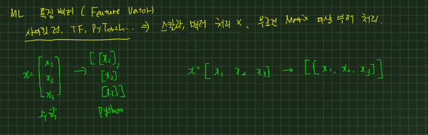
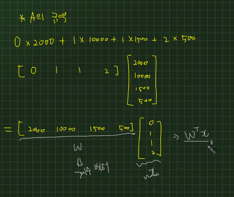

# 선형대수
연속적인 숫자들을 대신할수 있는 많은 양의 데이터
> 곱셈과 덧셈은 왜할까?
>> 덧셈 : 상위개념 요약(연관성 없는 애들을 연관을 지어주기 위해 상위개념을 지어주는 것 -> 오렌지와 사과의 가격을 합해줌)   
>> 곱셈 : 연관성 요약(오렌지에 해당되는 가격을 갯수에 곱해서 총 오렌지 가격을 구함)

## 수열과 집합의 합과 곱
1. 수열(sequence)   
    - N개 숫자 또는 변수가 순서대로 나열된 것으로 문자에 붙은 아래 첨자는 순서를 나타내는 숫자로서 인덱스(index)라고 부름
      - index : 1, 2, 3으로 일반적으로 프로그래밍이지 않은것 
      - offset index : 첫번째 데이터에서 얼마나 떨어져 있는지 보는것으로 프로그래밍인 것(0, 1, 2, 3)
    -  너무 길면은 중간에 ...으로 생략할 수 있음
  
2. 집합(set)
   - 앞뒤로 {}가 붙음
   - 집합에서의 index는 id를 나타내 순서가 없는 고유값
   - 수학에서 가장많이 사용하는 집합이 실수 집합으로 $R$ 즉, 이세상에 존재하는 모든수가 들어있는 집합을 가장 많이 사용함
    $x ∈ R$
   - 두 개 이상의 숫자로 이뤄지면 집합의 크기도 당연히 달라짐
     - $R^n$으로 표현함


3. 수열의 합과 곱
   - 내가 가지고 있는 데이터를 더하거나 곱함
    1. 시그마($Σ$)      
    선형대수에서 많이 사용  
    2. 파이($Π$)   
    확률에서 많이 사용
   - 중첩 수식은 파이썬의 중첩 for문과 똑같음


## 데이터와 행렬

### 데이터의 유형
1. 스칼라(scalar)
   - 0차원 데이터(0-Rank T)
   - 하나의 숫자만으로 이뤄진 데이터
2. 벡터(vector)
   - 1차원 데이터(행, 열을 볼때 한방향으로만 데이터가 증가함함_1-Rank T)
     - 행 벡터(Row) : 한 개의 표본에 대한 n개의 데이터
     - 열 벡터(Column) : n개의 표본에 대한 한가지 데이터 
   - (예시) 수열의 유형 중 하나로 판다스의 시리즈로 볼 수 있음
3. 행렬(matrix)
   - 2차원 데이터(2-Rank T)
   - $N * M$ : $N$명에 대해서 $M$개의 정보를 구하기
   - 행렬로 스칼라를 1 * 1로, 벡터를 1 * n, n * 1로 표현 할수 있음   
   이게 왜 중요하냐면, 파이썬에서는 스칼라, 벡터를 처리하지 못해서 무조건 행렬로 나타내고 처리해야함
   <p align="center">
      
   </p>
   - (예시) 판다스의 데이터프레임
4. 텐서(tensor) 
   - 3차원 이상의 다차원 배열 데이터
   - (활용) 딥러닝시 많이 다루는 내용
   - 이를 통해 이미지의 유사도를 비교할 수 있음

### 전치 연산   
행렬에서 가장 기본이 되는 연산으로 행렬의 행과 열을 바꾸는 연산
- `대각선을 중심`으로 행과 열의 원소가 바뀐다 생각하면 편함 
- $X$라는 행렬이 있으면 보통 열벡터로 이해를 하여 $X^T$는 행 벡터로 이해
    <p align="center">
    
    </p>

### 특수한 벡터와 행렬
1. 영벡터   
모든 원소가 0
   - NumPy에서 일벡터 생성 = `ones()`

2. 정방행렬   
행의 개수와 열의 개수가 같은 행렬

3. 대각 행렬  
행렬에서 행과 열이 같은 위치
   - 즉, 모든 비대각 요소가 0인 행렬
   - NumPy에서 대각 정방행렬 생성 = `diag()`

4. 항등행렬    
대각행렬 중에서도 모든 대각성분의 값이 1인 대각행렬
   - 항등행렬은 보통 알파벳 대문자 `I`로 표기
   -  NumPy에서 대각 정방행렬 생성 = `identity()` or `eye()`

5. 대칭행렬   
전치연산을 통해서 얻은 전치행렬과 원래의 행렬이 같음
   - 정방행렬만 대칭행렬이 될 수 있음
 
## 벡터와 행렬의 연산

1. 벡터.행렬의 덧셈과 뺄셈
   - 연산을 할때 꼭 두 벡터의 모양은 일치해야함
   - 같은 위치에 있는 원소끼리 연산이 이뤄짐

2. 스칼라와 벡터.행렬의 곱셈
   - 스칼라값은 모든 벡터 원소에 분배되어 곱해짐 

3. **선형조합(linear combination)**(중요!)   
   - 벡터/행렬에 스칼라값을 곱한 후 더하거나 뺀 것
    > 하지만, 벡터나 행렬을 선형조합해도 크기는 변하지 않음. 즉, 차수가 변하지 않음

4. 벡터와 벡터의 곱셈($x^Ty$)
   - 정보와 정보의 조합으로 하나의 값으로 나타냄
   - 내적(inner product)혹은 닷 프로덕트(dot product)라고 불림   
   - 아래 코드를 보면 무조건 내적을 하는구나라고 생각해야함    
   $$x⋅y=<x,y>=x^Ty$$
   - 내적을 하기위해 두 조건을 만족해야함
     1. 두 벡터의 차원(길이)가 같아야함
     2. `ㅓ`의 형태로 앞의 벡터가 행 벡터이고 뒤의 벡터가 열 벡터여야 함($x^Ty$)
   - 같은 위치에 있는 원소들을 곱함
    > 여기서 잠깐! 그럼 앞이 열벡터이고 뒤가 행벡터인것은 뭘까?($xy^T$)
    >> 외적으로 불리며 `ㅏ`의 형태로 내적은 곱해서 더한다면 외적은 곱한뒤 나열만 한다
    

    외적 예시1) 길이가 같은 일벡터 1N∈RN와 행벡터 x∈RN의 곱은 행벡터 x를 반복하여 가지는 행렬과 같음을 보여라.
    $$
    \mathbf{1}_N^{} x^T
    = 
    \begin{aligned}
    \begin{bmatrix}
    {x}^T \\
    {x}^T \\
    \vdots    \\
    {x}^T \\
    \end{bmatrix}
    \end{aligned}
    $$

    풀이)
    $$ 
    \mathbf{1}_N^{}
    =
    \begin{bmatrix}
    1 \\
    1 \\
    \vdots \\
    1 \\
    \end{bmatrix},
    \quad
    x
    =
    \begin{bmatrix}
    x_{1} \\
    x_{2} \\
    \vdots \\
    x_{N} \\
    \end{bmatrix},
    \quad
    x^T
    =
    \begin{bmatrix}
    x_{1} & x_{2} & \cdots & x_{N} 
    \end{bmatrix}
    \\[10pt]
    \mathbf{1}_N^{} \in \mathbf{R}^{N \times 1},
    \quad
    x^T \in \mathbf{R}^{1 \times N}
    \;
    \rightarrow
    \;
    \mathbf{1}_N^{} x^T \in \mathbf{R}^{N \times N} 
    \\[20pt]
    \begin{aligned}
    \mathbf{1}_N^{} x^T
    &=
    \begin{bmatrix}
    1 \\
    1 \\
    \vdots \\
    1 \\
    \end{bmatrix}
    \begin{bmatrix}
    x_{1} & x_{2} & \cdots & x_{N} 
    \end{bmatrix}
    \\
    &=
    \begin{bmatrix}
    1 \times x_{1} & 1 \times x_{2} & \cdots & 1 \times x_{N} \\
    1 \times x_{1} & 1 \times x_{2} & \cdots & 1 \times x_{N} \\
    \vdots & \vdots & \ddots & \vdots \\
    1 \times x_{1} & 1 \times x_{2} & \cdots & 1 \times x_{N} \\
    \end{bmatrix}
    \\
    &=
    \begin{bmatrix}
    {x}^T \\
    {x}^T \\
    \vdots    \\
    {x}^T \\
    \end{bmatrix}
    \end{aligned}
    $$

   
5. 가중합($w^Tx$)
   - 내적처럼 단순히 곱하는 것이아닌, 가중치를 사용
     - **가중치(weight)** : 결과를 결정할 때 부과적인 정보을 의미하며 절대값이 클 수록 결과에 영향을 많이 미침. 고유의 값으로 변하지 않음
     (예시) 머신러닝에서는 가중치가 결국 학습대상임
    <p align="center">
    
    </p>


6. 유사도
   - 두 벡터가 닮은 정도를 정량적을 나타낸 값
   - 내적을 이용하면 **코사인 유사도(cosine similarity)**라는 유사도를 계산할 수 있음

7. 제곱합($x^Tx$)
   - 데이터의 분산(variance)이나 표준 편차(standard deviation) 등을 구하는 경우에는 각각의 데이터를 제곱한 뒤 이 값을 모두 더함


### 선형회귀 모형
독립변수 x에서 종속변수 y를 예측하는 것 
- $y=ax$
- 독립변수들간에는 서로간에 연관성이 전혀 없음
  - 하지만 두 변수간 상관계수가 너무 높으면 다중공선성이 나타날 수 있어서 독립변수를 넣을때 항상 신중해야함
- 계수($a$)가 가중치!
  
**[한계점]**
- 데이터가 많아질수록 항상 직선 위에 데이터가 있을 수많은 없음
- 즉, 비선형적인 관계를 보이는데, 선형회귀로는 현실적인 데이터를 100%를 반영하기에는 어려움
- 적당하게 반영하는 것이 최선이기에 `추세선`을 사용! 
  > 즉, 이 추세선을 잘 구할 수 있는 가중치를 구하는 것이 머신러닝의 목적

### 행렬과 행렬의 곱셈
$$A * B = C$$
- $C$의 $i$번째 행, $j$번째 열의 원소 $c_{ij}$의 값은 $A$ 행렬의 $i$번째 행 벡터 $a^T_i$와 $B$ 행렬의 $j$번째 열 벡터 $b_j$의 곱
  > 이 정의가 성립하기 위해 앞의 행렬 A의 열의 수가 뒤의 행렬 B의 행의 수와 일치해야함 
- 넘파이에서 계산할때 `@` 연산자 또는 `dot()` 사용

### 교환법칙 분배법칙
```
일반적인 교환, 분배법칙
덧셈의 교환법칙 : A + B = B + A
곱셈의 교환법칙 : AB = BA
덧셈의 분배법칙 : A(B + C) = AB + AC
뺄셈의 분배법칙 : A(B - C) = AB - AC
```
- 스칼라에서는 교환, 분배법칙 모두 가능
1. 행렬 내적에서는 교환법칙이 성립하지 않을 수 있음!
   - 앞의 행렬의 열과 뒤의 행렬의 행의 수가 다를 수 가 있기 때문
    > 이에, 곱셈의 교환법칙은 성립하지 않음 
    $$AB≠BA$$
2. 분배는 가능하지만 조심해야함
   - A가 앞에있으면 앞으로만 붙어야함
    $$
    A(B+C)=AB+AC\\
    A(B+C)≠BA+CA
    $$
3. 전치 연산
   - 덧셈/뺄셈에 대해 분배 법칙이 성립
   - 그러나! 분배과정에서 곱셈의 순서가 바뀌게 됨
    $$
    (A+B)^T=A^T+B^T \\
    (AB)^T=B^TA^T\\
    (ABC)^T=C^TB^TA^T
    $$