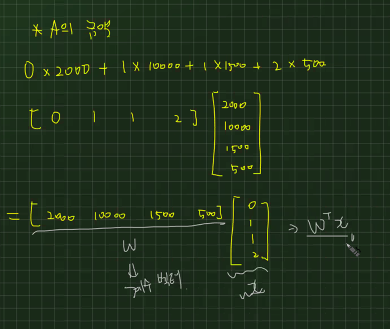
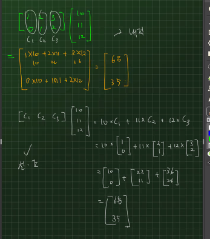
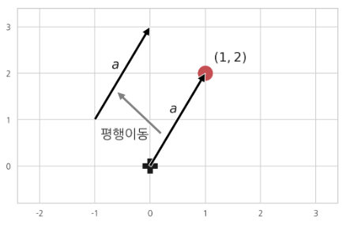
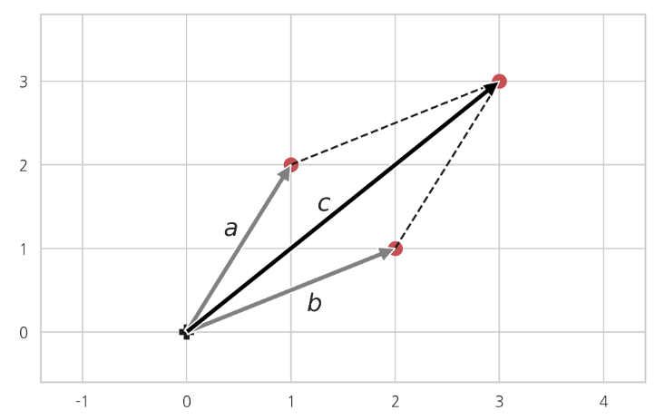
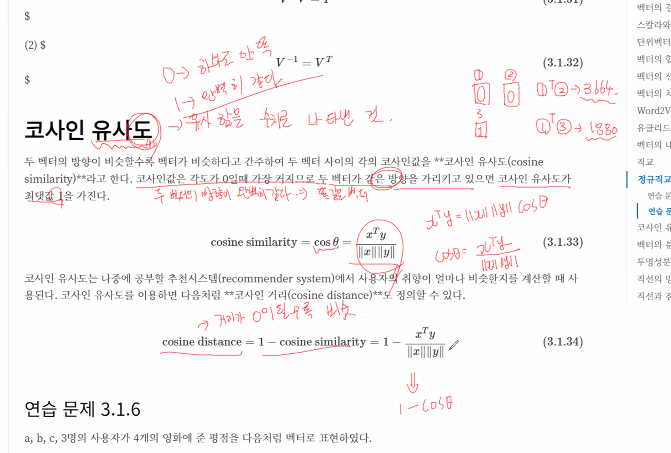
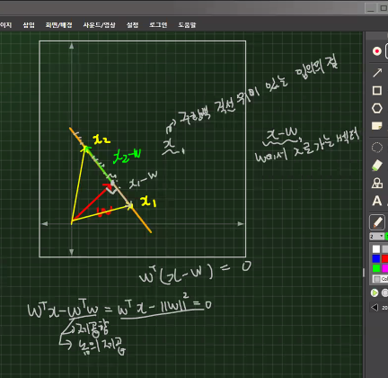
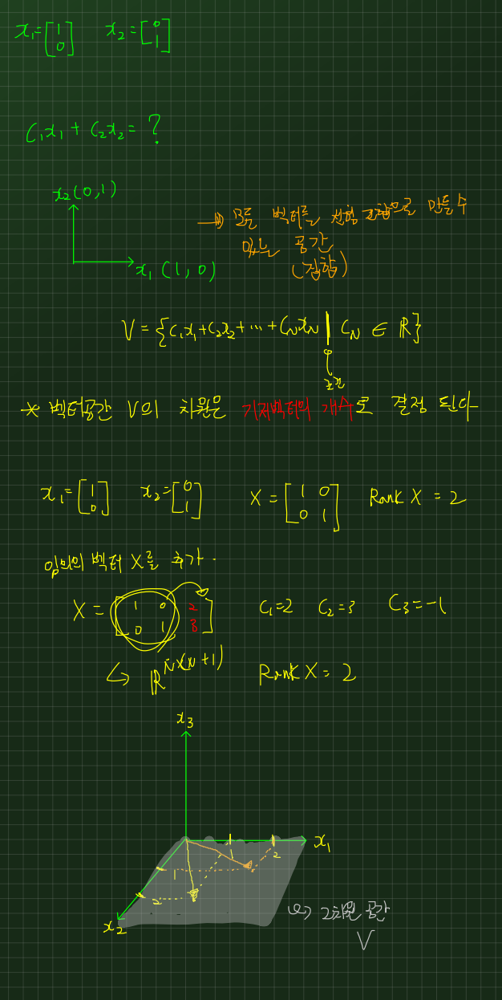
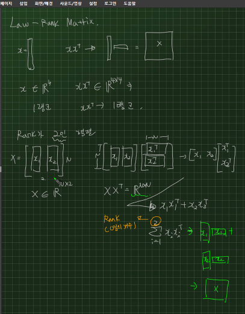

# 선형대수
연속적인 숫자들을 대신할수 있는 많은 양의 데이터
> 곱셈과 덧셈은 왜할까?
>> 덧셈 : 상위개념 요약(연관성 없는 애들을 연관을 지어주기 위해 상위개념을 지어주는 것 -> 오렌지와 사과의 가격을 합해줌)   
>> 곱셈 : 연관성 요약(오렌지에 해당되는 가격을 갯수에 곱해서 총 오렌지 가격을 구함)

## 수열과 집합의 합과 곱
**1. 수열(sequence)**  
- N개 숫자 또는 변수가 순서대로 나열된 것으로 문자에 붙은 아래 첨자는 순서를 나타내는 숫자로서 인덱스(index)라고 부름
- index : 1, 2, 3으로 일반적으로 프로그래밍이지 않은것 
- offset index : 첫번째 데이터에서 얼마나 떨어져 있는지 보는것으로 프로그래밍인 것(0, 1, 2, 3)
-  너무 길면은 중간에 ...으로 생략할 수 있음
  
**2. 집합(set)**
- 앞뒤로 {}가 붙음
- 집합에서의 index는 id를 나타내 순서가 없는 고유값
- 수학에서 가장많이 사용하는 집합이 실수 집합으로 $R$ 즉, 이세상에 존재하는 모든수가 들어있는 집합을 가장 많이 사용함
 $x ∈ R$
- 두 개 이상의 숫자로 이뤄지면 집합의 크기도 당연히 달라짐
  - $R^n$으로 표현함


**3. 수열의 합과 곱**
- 내가 가지고 있는 데이터를 더하거나 곱함
  1. 시그마($\Sigma$)      
  선형대수에서 많이 사용  
  2. 파이($\Pi$)   
  확률에서 많이 사용
- 중첩 수식은 파이썬의 중첩 for문과 똑같음


## 데이터와 행렬

### 데이터의 유형
**1. 스칼라(scalar)**
- 0차원 데이터(0-Rank T)
- 하나의 숫자만으로 이뤄진 데이터

**2. 벡터(vector)**
- 1차원 데이터(행, 열을 볼때 한방향으로만 데이터가 증가함함_1-Rank T)
 - 행 벡터(Row) : 한 개의 표본에 대한 n개의 데이터
 - 열 벡터(Column) : n개의 표본에 대한 한가지 데이터 
- (예시) 수열의 유형 중 하나로 판다스의 시리즈로 볼 수 있음

**3. 행렬(matrix)**
- 2차원 데이터(2-Rank T)
- $N * M$ : $N$명에 대해서 $M$개의 정보를 구하기
- 행렬로 스칼라를 1 * 1로, 벡터를 1 * n, n * 1로 표현 할수 있음   
이게 왜 중요하냐면, 파이썬에서는 스칼라, 벡터를 처리하지 못해서 무조건 행렬로 나타내고 처리해야함
- (예시) 판다스의 데이터프레임

**4. 텐서(tensor)** 
- 3차원 이상의 다차원 배열 데이터
- (활용) 딥러닝시 많이 다루는 내용
- 이를 통해 이미지의 유사도를 비교할 수 있음

### 전치 연산   
행렬에서 가장 기본이 되는 연산으로 행렬의 행과 열을 바꾸는 연산
- `대각선을 중심`으로 행과 열의 원소가 바뀐다 생각하면 편함 
- $X$라는 행렬이 있으면 보통 열벡터로 이해를 하여 $X^T$는 행 벡터로 이해

### 특수한 벡터와 행렬
**1. 영벡터**   
모든 원소가 0
- NumPy에서 일벡터 생성 = `ones()`

**2. 정방행렬**    
행의 개수와 열의 개수가 같은 행렬

**3. 대각 행렬**   
행렬에서 행과 열이 같은 위치
- 모든 비대각 요소가 0인 행렬
- NumPy에서 대각 정방행렬 생성 = `diag()`

**4. 항등행렬**   
대각행렬 중에서도 모든 대각성분의 값이 1인 대각행렬
- 항등행렬은 보통 알파벳 대문자 `I`로 표기
- NumPy에서 대각 정방행렬 생성 = `identity()` or `eye()`

**5. 대칭행렬**   
전치연산을 통해서 얻은 전치행렬과 원래의 행렬이 같음
- 정방행렬만 대칭행렬이 될 수 있음
 
## 벡터와 행렬의 연산

**1. 벡터.행렬의 덧셈과 뺄셈**
- 연산을 할때 꼭 두 벡터의 모양은 일치해야함
- 같은 위치에 있는 원소끼리 연산이 이뤄짐

**2. 스칼라와 벡터.행렬의 곱셈**
- 스칼라값은 모든 벡터 원소에 분배되어 곱해짐 

**3. 선형조합(linear combination)(중요!)**
- 벡터/행렬에 스칼라값을 곱한 후 더하거나 뺀 것
> 하지만, 벡터나 행렬을 선형조합해도 크기는 변하지 않음. 즉, 차수가 변하지 않음

**4. 벡터와 벡터의 곱셈($x^Ty$)**
- 정보와 정보의 조합으로 하나의 값으로 나타냄
- 내적(inner product)혹은 닷 프로덕트(dot product)라고 불림   
- 아래 코드를 보면 무조건 내적을 하는구나라고 생각해야함    
$$x⋅y=<x,y>=x^Ty$$
- 내적을 하기위해 두 조건을 만족해야함
  1. 두 벡터의 차원(길이)가 같아야함
  2. `ㅓ`의 형태로 앞의 벡터가 행 벡터이고 뒤의 벡터가 열 벡터여야 함($x^Ty$)
- 같은 위치에 있는 원소들을 곱함
> 여기서 잠깐! 그럼 앞이 열벡터이고 뒤가 행벡터인것은 뭘까?($xy^T$)
>> 외적으로 불리며 `ㅏ`의 형태로 내적은 곱해서 더한다면 외적은 곱한뒤 나열만 한다

외적 예시1) 길이가 같은 일벡터 1N∈RN와 행벡터 x∈RN의 곱은 행벡터 x를 반복하여 가지는 행렬과 같음을 보여라.
$$
\mathbf{1}_N^{} x^T
= 
\begin{aligned}
\begin{bmatrix}
{x}^T \\
{x}^T \\
\vdots    \\
{x}^T \\
\end{bmatrix}
\end{aligned}
$$

풀이)
$$ 
\mathbf{1}_N^{}
=
\begin{bmatrix}
1 \\
1 \\
\vdots \\
1 \\
\end{bmatrix},
\quad
x
=
\begin{bmatrix}
x_{1} \\
x_{2} \\
\vdots \\
x_{N} \\
\end{bmatrix},
\quad
x^T
=
\begin{bmatrix}
x_{1} & x_{2} & \cdots & x_{N} 
\end{bmatrix}
\\[10pt]
\mathbf{1}_N^{} \in \mathbf{R}^{N \times 1},
\quad
x^T \in \mathbf{R}^{1 \times N}
\;
\rightarrow
\;
\mathbf{1}_N^{} x^T \in \mathbf{R}^{N \times N} 
\\[20pt]
\begin{aligned}
\mathbf{1}_N^{} x^T
&=
\begin{bmatrix}
1 \\
1 \\
\vdots \\
1 \\
\end{bmatrix}
\begin{bmatrix}
x_{1} & x_{2} & \cdots & x_{N} 
\end{bmatrix}
\\
&=
\begin{bmatrix}
1 \times x_{1} & 1 \times x_{2} & \cdots & 1 \times x_{N} \\
1 \times x_{1} & 1 \times x_{2} & \cdots & 1 \times x_{N} \\
\vdots & \vdots & \ddots & \vdots \\
1 \times x_{1} & 1 \times x_{2} & \cdots & 1 \times x_{N} \\
\end{bmatrix}
\\
&=
\begin{bmatrix}
{x}^T \\
{x}^T \\
\vdots    \\
{x}^T \\
\end{bmatrix}
\end{aligned}
$$

**5. 가중합($w^Tx$)**
- 내적처럼 단순히 곱하는 것이아닌, 가중치를 사용
 - **가중치(weight)** : 결과를 결정할 때 부과적인 정보을 의미하며 절대값이 클 수록 결과에 영향을 많이 미침. 고유의 값으로 변하지 않음   
 (예시) 머신러닝에서는 가중치가 결국 학습대상임
<p align="center">

</p>

**6. 유사도**
- 두 벡터가 닮은 정도를 정량적을 나타낸 값
- 내적을 이용하면 **코사인 유사도(cosine similarity)**라는 유사도를 계산할 수 있음

**7. 제곱합($x^Tx$)**
- 데이터의 분산(variance)이나 표준 편차(standard deviation) 등을 구하는 경우에는 각각의 데이터를 제곱한 뒤 이 값을 모두 더함

### 선형회귀 모형
독립변수 x에서 종속변수 y를 예측하는 것 
- $y=ax$
- 독립변수들간에는 서로간에 연관성이 전혀 없음
  - 하지만 두 변수간 상관계수가 너무 높으면 다중공선성이 나타날 수 있어서 독립변수를 넣을때 항상 신중해야함
- 계수($a$)가 가중치!
  
**[한계점]**
- 데이터가 많아질수록 항상 직선 위에 데이터가 있을 수많은 없음
- 즉, 비선형적인 관계를 보이는데, 선형회귀로는 현실적인 데이터를 100%를 반영하기에는 어려움
- 적당하게 반영하는 것이 최선이기에 `추세선`을 사용! 
  > 즉, 이 추세선을 잘 구할 수 있는 가중치를 구하는 것이 머신러닝의 목적

### 행렬과 행렬의 곱셈
$$A * B = C$$
- $C$의 $i$번째 행, $j$번째 열의 원소 $c_{ij}$의 값은 $A$ 행렬의 $i$번째 행 벡터 $a^T_i$와 $B$ 행렬의 $j$번째 열 벡터 $b_j$의 곱
  > 이 정의가 성립하기 위해 앞의 행렬 A의 열의 수가 뒤의 행렬 B의 행의 수와 일치해야함 
- 넘파이에서 계산할때 `@` 연산자 또는 `dot()` 사용

### 교환법칙 분배법칙
```
일반적인 교환, 분배법칙
덧셈의 교환법칙 : A + B = B + A
곱셈의 교환법칙 : AB = BA
덧셈의 분배법칙 : A(B + C) = AB + AC
뺄셈의 분배법칙 : A(B - C) = AB - AC
```
- 스칼라에서는 교환, 분배법칙 모두 가능
1. 행렬 내적에서는 교환법칙이 성립하지 않을 수 있음!
   - 앞의 행렬의 열과 뒤의 행렬의 행의 수가 다를 수 가 있기 때문
    > 이에, 곱셈의 교환법칙은 성립하지 않음 
$$AB≠BA$$

2. 분배는 가능하지만 조심해야함
   - A가 앞에있으면 앞으로만 붙어야함
$$
A(B+C)=AB+AC\\
A(B+C)≠BA+CA
$$

3. 전치 연산
   - 덧셈/뺄셈에 대해 분배 법칙이 성립
   - 그러나! 분배과정에서 곱셈의 순서가 바뀌게 됨
$$
(A+B)^T=A^T+B^T \\
(AB)^T=B^TA^T\\
(ABC)^T=C^TB^TA^T
$$

---
**8. 항등행령의 곱셈**
- 어떤 행렬이든 항등행렬을 곱하면 그 행렬의 값이 변하지 않음
$$AI=IA=A$$
   
**9. 행렬과 벡터의 곱**    
행렬과 백터의 내적(곱)은 벡터
$$
x^T*A=x^T
\\
A*x=x
$$
   
  1. 열 벡터의 선형조합
     - 각 물품마다의 가격을 볼 수 있음
     - 기존 내적으로 계산을 할수 있지만 선형조합의 방식으로도 계산을 할 수 있음
     <p align="center">
     
     </p>
   
  2. 여러 개의 벡터에 대한 가중합 동시 계산
     - 가중치는 데이터의 개수와는 상관이 없고 데이터의 종류만큼 가지고 있음. 즉, 열의 수만큼 있음
     - 여러개의 미지수가있고 거기에 대하 가중치를 한번에 계산을 하는 것 
    
**10. 잔차(residual) or 오차(error)**
- 예측치($\hat{y}$)와 실젯값(target) $y_i$의 차이
- 잔찻값을 모든 독립변수 벡터에 대해 구하면 잔차 벡터 $e$
$$e_i=y_i−\hat{y}_i=y_i−w^Tx_i$$

**11. 잔차 제곱합(RSS: Residual Sum of Squares)**
- 절대적 거리를 확인하기 위해 음수를 제거하는 방법
- 즉, 각 잔차(오차)를 제곱하여 더함
- 오차제곱합(SSE)와 같은 개념으로 볼 수 있음

**12. 이차형식**
- $A$가 정방행렬 일때 $x^TAx$를 이차형식이라 함
- 결국 모든 원소들의 곱의 합이 된다
  - 참고로 여기서 곱한다는 것은 같은 위치에 있는 원소를 말하는 것으로    
  예시) 행렬의 (1,3)에 위치한 원소가 10이면 $1*3*10$을 함. 그리고 행렬에 각 위치별로 이런식으로 다 곱해서 더하면 최종값이 나옴
$$
x^TAx=\sum_{i=1}^N\sum_{j=1}^Na_{i,j}x_ix_j
$$

### :star:스칼라, 벡터, 행렬의 곱 공식
- 행벡터와 열벡터는 스칼라
- 행벡터와 행렬은 행벡터
- 행렬과 열 벡터는 열벡터
- 즉, 행력과 벡터의 곱은 벡터

### 부분행렬
2차 정방행렬 A, B는 부분행렬을 이용해 여러 방법으로 계산할 수 있음
1. 앞에 곱해지는 행렬을 행벡터로 나눠 게산함
2. 혹은 뒤에 곱해지는 행렬을 열벡터로 나눠 계산함
3. 혹은 마지막으로 앞에 곱해지는 행렬을 열벡터로, 뒤에 곱해지는 행렬을 행벡터로 나눠 스칼라처럼 계산해도 괜찮음

## 행렬의 성질

### 정부호와 준정부호
- 대칭행렬에 대해서만 정의함
- 이때 벡터 $x$는 영벡터가 아님($x \neq \mathbf{0}$). 
   - 벡터 $x$가 영벡터라면 모든 행렬(여기서는 $A$)는 항상 양의 준정부호가 되기 때문
1. 정부호(positive definite)
   - x는 절대 0벡터가 될 수 없음   
$$x^TAx>0$$
2. 준정부호(positive semi-definite)
   - 0을 포함함   
$$x^TAx\geq 0$$

### 행렬의 크기
**1. 행렬 놈**
- 벡터나 행렬의 크기를 일반화 시킨 것
- 우리는 p를 무조건 2를 사용 할 것. 그래서 p값이 표현안되어 있으면 걍 2구나 라고 생각할 것 
  - $L^2-Norm$=프로베니우스 놈(Frobenius norm)=원점과의 거리=유클리드 놈([참고](https://eehoeskrap.tistory.com/227))
- 놈은 항상 0보다 크거나 같음
- 당연히 모든 크기의 행려에 대해 정의가 가능하니 벡터에 대해서도 정의 할 수 있음
  - (중요!) 벡터의 놈의 제곱 = 벡터의 제곱합과 같음   
$$\|x\|^2=\sum_{i=1}^Nx_i^2=x^Tx$$
- 놈의 제곱이 가장 작을 때 놈도 가장 작음. 즉, 0일때 가장 작음
- 4가지 성질
   1. 놈의 값은 0 이상
   2. 행렬에 스칼라를 곱하면 놈의 값도 스칼라의 절대값을 곱한 것과 같음
   3. 행렬의 합의 놈은 각 행렬의 놈의 합보다 작거나 같음
      - 음수가 있을 수 있어서
   4. 정방행렬의 곱의 놈은 각 정방행렬의 놈의 곱보다 작거나 같음
> 즉, 오차제곱합을 잘 구하기 위해 봐야함

**2. 대각합**
- 정방행렬에 대해서만 정의됨
- 주 대각 방향에 있는 값을 다 더한 합. 한마디로 대각선의 값들의 합
- 특징
   1. 더하기만 하다보니 음수가 될 수 있음
   2. 스칼라를 곱하면 대각합은 스칼라와 원래의 대각합의 곱
   3. 전치연산을 해도 대각합은 그대로
   4. 두 행렬의 합의 대각합은 두 행렬의 대각합의 합
   5. 두 행렬의 곱의 대각합은 행렬의 순서를 바꿔도 달라지지 않음
   6. 세 행렬의 곱의 대각합은 순서를 순환 시켜도 달라지지 않음
$$tr(ABC)=tr(BCA)=tr(CAB)$$
> 결론은 대각합은 거의 똑같음

**3. 행렬식(determinant)**
- 정방행렬 A의 행렬식은 $det(A)$, $detA$, 또는 $|A|$라는 기호로 표기
- 행렬A가 스칼라인 경우 행렬식이 자기 자신의 값으로 표현 됨
- 스칼라가 아니라면, 행렬식은 더이상 나눠지지않을 정도로 스칼라의 값이 나올때 까지 계속해서 여인수 전개를 이용해 계산 하는 것으로 **재귀적**이라 할 수 있음
   $$
   \det(A)=\sum_{i=1}^N \{(-1)^{i+j_0}M_{i, j_0}\}a_{i, j_0}
   \\
   or
   \\
   \det(A)=\sum_{j=1}^N \{(-1)^{i_0+j}M_{i_0, j}\}a_{i_0, j}
   $$
   - $(-1)^{i+j_0}$ = 지정한 행/열의 원소 앞에 곱해지는 값(부호)   
   - $a_{i, j_0}$ =  지정한 행/열의 원소   
   - $M_{i, j_0}$ = 마이너(소행렬식)로 정방행렬 $A$에서 선택된 $i$, $j$를 삭제하고 얻어낸 행렬의 행렬식
   
- 행렬식 풀이과정
  1. 행 또는 열 지정
  2. 식 전개
  3. 소 행렬식 전개 
  4. 각 소 행렬식에 대해 행렬식 또 전개
  5. 스칼라가 나올때 까지 무한루프
  6. 스칼라가 나오면 전체 더하기
- 성질
  1. 전치 행렬의 행렬식은 원래의 행렬의 행렬식과 같다
  2. 항등 행렬의 행렬식은 1
  3. 두 행렬의 곱의 행렬식은 각 행렬의 행렬식의 곱과 같다
  4. 역행렬 $A^{−1}$은 원래의 행렬 A와 다음 관계를 만족하는 정방행렬을 말한다
  5. 행렬의 행렬식은 원래의 행렬의 행렬식의 역수와 같다
  6. 역행렬의 정의와 여인수 전개식을 사용하여 증명할 수 있다
  7. 즉, 역행렬의 판단여부를 확인할 수 있음
- 2차 정방행렬의 행렬식 공식
$$
\det \left( \begin{bmatrix}a&b\\c&d\end{bmatrix} \right) = ad-bc
$$

   
## 선형 연립방정식과 역행렬
입력 데이터 벡터와 가중치 벡터의 내적으로 계산된 예측값이 실제 출력 데이터와 유사한 값을 출력하도록 하는 모형
> 즉, 가중 벡터를 제외한 나머지 값은 다 알기에 연립방정식을 활용하여 가중 벡터값을 구함. 
>> 가감법, 대입법 사용. 하지만 데이터가 많아지면 한계가 있어서 역행렬을 사용

특히 행렬에서는 나눗셈의 개념이 없어 역행렬을 사용해 미지수의 값을 구해야함

### 역행렬
정방 행렬 A에 대한 역행렬(inverse matrix) $A{^−1}$은 원래의 행렬 A와 다음 관계를 만족하는 정방 행렬
- 역행렬의 종류
  1. 역행렬이 존재하는 행렬을 가역행렬(invertible matrix), 정칙행렬(regular matrix) 또는 비특이행렬(non-singular matrix)
  2. 역행렬이 존재하지 않는 행렬을 비가역행렬(non-invertible matrix) 또는 특이행렬(singular matrix), 퇴화행렬(degenerate matrix)
- 역행렬의 성질
  1. 전치 행렬의 역행렬 = 역행렬의 전치 행렬
  2. 대칭 행렬의 역행렬 = 대칭 행렬
  3. 크기가 같은 정방행렬의 곱의 역행렬은 전치가 분배될때 순서가 바뀌는 것처럼 얘도 순서가 바뀌어서 나옴
  $$(AB)^{-1}=B^{-1}A^{-1}$$
- 역행렬의 계산
  - det(A)이 0이 아니면 역행렬이 존재함 
   > det(A)를 벌써 까먹은거 아니지,,? 행렬식! ad-bc!!!
  - 즉, 역행렬이 존재하면 연립방정식이 아예 풀지를 못함. 왜냐면 행렬을 넘기지를 못하기 때문
  어드조인트행렬은 공부할 필요가 없음

$$
\begin{bmatrix}
a_{11}&a_{12}\\
a_{21}&a_{22}
\end{bmatrix}^{-1} = \frac{1}{a_{11}a_{22}-a_{12}a_{21}}
\begin{bmatrix}
a_{22}&-a_{12}\\
-a_{21}&a_{11}
\end{bmatrix}
$$

#### 역행렬에 대한 정리
(너무 깊에 공부하진 말고 아 이런게 있구나 정도로만 보기)
  1. 셔먼-모리슨 공식
  2. 우드베리 공식
  3. 분할행렬의 역행렬   
    - 내가 원하는 크기만큼 행렬을 잘라서 자른부분에 대해서 역행렬을 구하는것   
    - 이렇게 하면 100 by 100의 행렬처럼 데이터의 양이 많을 때 분할해서 효율적으로 역행렬을 구할 수 있음

### 선형 연립방정식과 선형 예측모형
- 우린 결국 가중치벡터(w)를 구하는 것이 중요 
- 하지만 가중치벡터를 구하기 위해서는 특징행렬의 역행렬이 꼭 존재해야함
$$w=X^{−1}y$$

### 미지수와 방정식의 수
미지수의 수와 방정식의 수가 같은 선형연립방정식에 대해서 생각했지만 사실 세상의 다양한 현상에서는 개수가 다를 확률이 더 빈번함

**미지수(M)** = 종류의 개수   
**방정식의 수(N)** = 타겟(표본)의 개수
- 연립방정식 종류
   1. 방정식의 수가 미지수의 수와 같다. (N=M)
   2. 방정식의 수가 미지수의 수보다 적다. (N<M)
      - 방정식의 수가 미지수의 수보다 적다 -> 데이터의 개수가 종류보다 적은 경우
      - 정확하지도 않고 불안정하기에 못써먹을 확률이 높음
      - 무수히 `많은 해가 존재`함
   1. 방정식의 수가 미지수의 수보다 많다. (N>M)
      - 데이터의 개수가 종류보다 많은 경우
      - 데이터의 종류는 한계가 있기에 이 경우가 제일 많이 보임
      - 모든 방정식을 만족하는 해(W)를 구하는 건 불가능함
      - 이를 해결하기 위해 `최소자승문제(최소제곱법)`을 활용함

### 최소자승문제(최소제곱법)_노트필기 참고
선형 연립방정식의 해가 존재하지 않을때 선형 예측모형을 구하는 방법
- 즉, 정확하게 똑같지 않아도 된다는 전제로 비슷한 해(w)를 구함
- 그런데 이럴 경우 오만가지 w가 나오게 됨. 왜냐면 완벽한 해를 구하는게 아니기에,,,
- 그럼 이중에 어떤 w를 선택할까? 
  > 잔차($e=Ax-b$)를 사용해 $Ax$의 결과인 예측값($\hat{y}$)이 실제 값(b)과 가장 오차 없게 하는 x를 구하자 
  - x를 최소화하기 위해 벡터의 놈을 최소화 함.   
  놈의 최소화는 놈의 제곱을 최소화 하는것과 같음.     
  -> 중요!! 여기서 잔차제곱합 = 놈의 제곱
  $$e^Te=||e||^2=(Ax-b)^T(Ax-b)$$
  $$x=argmine^Te$$
- x를 구하는 방법
   1. 의사 역행렬
      - $Ax-b=0$에 양변에 전치 A를 곱해서 구하기
   $$x=A^+b$$
   2. 검사 하강법   

# 고급 선형대수

## 선형대수와 해석기하의 기초

### 벡터의 기하학적 의미
N차원 벡터 a는 N차원의 공간에서 
- 벡터 a의 값으로 표시되는 점(point) 또는 
- 원점과 벡터 a의 값으로 표시되는 점을 연결한 화살표(arrow)라고 생각할 수 있음
  -  벡터를 화살표로 생각하는 경우에는 길이와 방향을 고정시킨 채 평행이동할 수 있음
   <p align="center">
      
   </p>
- 벡터표기법
  - (수평 이동량, 수직 이동량)으로 나타내거나 -> $\vec{v}=(5,0)$
  - 열 벡터로 나타냄 -> $\vec{v}=\begin{bmatrix}5 \\ 0\end{bmatrix}$

**1. 벡터의 길이**    
`벡터 a의 길이`는 놈 `||a||`으로 정의
$$
\| a \| = \sqrt{a^T a } = \sqrt{a_1^2 + \cdots + a_N^2}
$$

**2. 스칼라와 벡터의 곱**    
양의 실수와 벡터를 곱하면   
> 방향변화 X, 실수의 크기만큼 길이가 증가!

**3. 단위벡터**
- 길이($\| x \|$)가 1인 벡터
- 영벡터가 아닌 임의의 벡터 x에 대해 다음 벡터는 벡터 x와 같은 방향을 가리키는 단위벡터가 됨
$$\dfrac{x}{\| x \|}$$

**4. 벡터의 합**    
벡터 + 벡터 = 벡터
- 두 벡터의 합은 그 두 벡터를 이웃하는 변으로 가지는 평행사변형의 대각선 벡터
- 또한 평행사변형으로 이웃하는 벡터 하나를 평행이동하여 삼각형을 나타낼 수도 있음
<p align="center">
   
</p>

$$
c= a+b
$$


**5. 벡터의 선형조합**
- 선형대수학 관점에서 여러 데이터는 묶여 있어야 좋음
- 여러 개의 벡터를 스칼라곱을 한후에 더하는 것이 `선형조합(linear combination)`

**6. 벡터의 차**
- 벡터의 차 a−b=c는 벡터 b가 가리키는 점으로부터 벡터 a가 가리키는 점을 연결하는 벡터
- 백터 b에 벡터 a−b를 더하면, 즉 벡터 b와 벡터 a−b를 연결하면 벡터 a가 되어야 하기 때문
$$
a-b=c\\
b+c=b+(a-b)=a
$$
   
**7. 유클리드 거리**    
두 벡터가 가리키는 점 사이의 거리
- 두 벡터의 유클리드 거리는 벡터의 차의 길이로 구할 수 있음
$$ 
\begin{aligned} 
\| a - b \|
&= \sqrt{\sum_{i=1} (a_i - b_i)^2} \\
&= \sqrt{\sum_{i=1} ( a_i^2 - 2 a_i b_i + b_i^2 )} \\
&= \sqrt{\sum_{i=1} a_i^2 + \sum_{i=1} b_i^2 - 2 \sum_{i=1} a_i b_i} \\
&= \sqrt{\| a \|^2 + \| b \|^2  - 2 a^Tb }
\end{aligned}
$$

즉,

$$
\| a - b \|^2 = \| a \|^2 + \| b \|^2 - 2 a^T b
$$

**8. 직교**   
두 벡터 a와 b가 이루는 각이 90도이면 서로 직교(orthogonal)라고 하며 $a⊥b$로 표시
- 서로 직교인 두 벡터의 내적은 0

**9. 정규직교**   
N 개의 단위벡터 $v_1,v_2,⋯,v_N$가 서로 직교
- 직교인 나 자신과의 내적은 언제나 1
- 내가 아닌 다른 벡터와의 직교인 내적은 항상 0 


**10. 코사인 유사도**
- 두 벡터의 방향이 비슷할수록 벡터가 비슷하다고 간주하여 두 벡터 사이의 각의 코사인값
- 코사인값은 각도가 0일때 가장 커지므로 두 벡터가 같은 방향을 가리키고 있으면 코사인 유사도가 최댓값 1 -> 이건 한마디로 똑같다라는 의미
<p align="center">
   
</p>

> 추천시스템에서는 코사인 유사도를 많이 사용

### 벡터의 분해와 성분
a, b의 합이 다른 벡터 c가 될 때 
- a, b를 c의 성분(component)이라 부름
- 하지만 이러면 무수하게 많은 성분이 추출되기에 우리는 투영성분과 직교성분만을 사용함
- 투영성분과 직교성분을 더하면 c의 값이 나옴
  1. 투영성분($a^{\Vert b}$)
     - 평행한 성분
   $$||a^{\Vert b}||=a^T\dfrac{b}{\|b\|}=a^Tb$$
  2. 직교성분($a^{\perp b}$) 
     - 벡터 b에 직교하는 성분 
     - 원래의 벡터에서 투영성분 성분 벡터를 뺀 나머지
   $$a^{\perp b} = a - a^{\Vert b}$$

### 직선의 방정식
임의의 벡터 W가 있을때
- 원점에서 출발한 벡터 w가 가리키는 점을 지나면서
- 벡터 w에 수직인 직선의 방정식
<p align="center">
   
</p>

#### 직선과 점의 거리
직선 위에 있지 않은 점을 사용해 점과 직선 사이의 거리를 구함
- $cw$와 $x'$는 무조건 평행하기에 $x'$를 $cw$에 투영할 수 있음
- 즉, 직선의 방정식과 매우 유사한 것을 알 수 있음
- 노트 필기 참고


## 좌표와 변환
이미지 데이터를 다룰때 사용. 즉, 공간에 대한 이해

### 선형 종속과 선형 독립
선형종속(linearly dependent) : 벡터 집합 $x_1, x_2, \ldots, x_N$을 이루는 벡터의 선형조합이 영벡터가 되도록 하는 스칼라 계수 $c_1, c_2, \ldots, c_N$이 존재하는 벡터들
$$ 
c_1 x_1 + c_2 x_2 + \cdots + c_N x_N = 0  
$$

선형독립(linearly independent) : 벡터들의 선형조합이 0이 되면서 계수가 모두 0인 벡터들
$$ 
c_1 x_1 + \cdots + c_N x_N = 0  \;\; \rightarrow \;\; c_1 = \cdots = c_N = 0  
$$ 

**1. 선형독립과 선형 연립방정식**   
행렬을 열벡터로 쪼개서 내적을 시키면 선형조합으로 행렬의 형태로 연립방정식을 할 수 있음
$$X_e=0$$
- 역행렬이 존재하면 무조건 선형 독립

**2. 선형종속인 경우**   
특징행렬이 선형종속이면 회귀식을 하지 못할 수 있음   
> 선형종속이거나 선형종속에 가까울수록 다중공선성이 나타나 예측력이 떨어질수 있어 위험함
- 그래서 머신러닝을 하기전 EDA를 통해 각 변수간 연관성을 먼저 파악하고 그 뒤에 전처리를 시작해야함
  1. 벡터의 개수가 벡터의 차원보다 크면 선형종속
     - 행의 갯수 보다 열의 갯수가 많은 상황으로 해가 무수히 많아짐(N < M)
     - 하지만, 일반적으로 데이터의 종류보다 갯수가 많기에 이런일이 잘 일어나지는 않음
  2. 값이 같은 벡터가 있으면 반드시 선형종속
     - 엑셀에서 데이터를 합할때 중복된 데이터가 있을 수도 있음
  3. 어떤 벡터가 다른 벡터의 선형조합이면 반드시 선형종속
     - 가장 많이 나오는 실수 중 하나
     - 파생변수와 파생변수를 만들때 사용한 변수들 간에 다중공선성이 나올 확률이 엄청 높음
     - 이에, 조합된 데이터는 머신러닝에서 분석할때 제외하고 사용해야 함
     - (예시) 국영수과목이 있고 국영수 평균은 각 과목벡터들간의 선형조합으로 나오는 것    
     -> 반대로 평균의 값이 꼭 필요해서 분석때 수학, 영어, 국어를 제하고 평균값만 넣으면 상관없기는 하지만 그래도 일반적으로는 데이터의 종류가 줄어드는것도 있고 일반적으로는 조합된것을 사용하지는 않음

### 랭크(Rank)
행렬의 열벡터 중 서로 독립인 열벡터의 최대 개수를 **열랭크(column rank)**라고 하고 행벡터 중 서로 독립인 행벡터의 최대 개수를 **행랭크(row rank)**
> 행랭크와 열랭크는 항상 같다
>> 그래서 그냥 랭크라고 부름
- 하나의 행렬을 열백터로 나눠 볼경우
   1. 1개의 벡터만 선택 -> 무조건 독립
   2. 2개의 벡터를 선택 -> 독립이거나 종속
   3. 3개의 벡터를 선택 -> 독립이거나 종속
   4. 4개의 벡터를 선택 -> 독립이거나 종속 
      - rank = 3
      - 왜냐면 rank가 3일때까지 독립이고 이후부터는 종속이 되기 때문
- 5, 6개의 벡터를 선택 -> 종속
- 랭크는 열의 갯수 혹은 행의 갯수가 작은것보다 커질 수 없음
$$rankA<=min(M,N)$$

**1. 풀랭크**   
선형 분석을 하기위한 최상의 상태
   - X1나 X2처럼 랭크가 행의 개수와 열의 개수 중 작은 값과 같은경우
$$rankA=min(M,N)$$
- 역행열이 무조건 존재함

**2. 로우-랭크 행렬(랭크-1)**
- 특색있는 데이터가 적은 행렬
- 써먹을 일 없음. 아 이런게 있구나 정도

**3. 랭크와 역행렬**
> 정방행렬이 풀랭크면 역행렬이 존재한다. 역도 성립한다. 
>> 정방행렬의 역행렬이 존재하면 풀랭크다
>> 정방행렬이 풀랭크다 ↔ 역행렬이 존재한다


### 벡터공간과 기저벡터 
벡터공간(벡터space) 
- 모든 벡터의 집합   
$c_1x_1 + c_2x_2=?$로 만들 수 있는 ?는 무한
- 기저벡터는 항상 선형독립
$$V={c_1x_1+c_2x_2+...+c_nx_n|c_n는 실수}$$
- 벡터공간 v의 차원은 기저벡터의 개수로 결정지어짐
- 2차원인 벡터의 기저벡터는 2개 
- 3차원인 벡터의 기저벡터도 3개
> N 개의 N차원 벡터 x1,x2,⋯,xN이 선형독립이면 이를 선형조합하여 모든 N차원 벡터를 만들 수 있다
- 3번째 예제는 기저벡터의 개수가 2개이기에 3차원 공간이지만 2차원 벡터공간밖에 만들수 없음
<p align="center">
   
</p>

### 벡터공간 투영
모든 N차원 벡터 x에 대해 기저벡터 $v_1,...,v_n$을 선행조합해서 만든 백터 $x^{||v}$와 벡터 x의 차 $x-x^{||v}$가 모든 기저 벡터에 직교하면 $x^{||v}$를  $v_1,...,v_n$에 대한 투영 벡터라 한다. $x-x^{||v}=x^{⊥v}$를 벡터공간 v에 대한 직교벡터라 한다

###  정규직교인 기저벡터로 이루어진 벡터공간
- 직교벡터의 성질
  1. 모든 기저벡터 v에 대해 수직(직교임). 즉, 기저벡터와 내적하면 0
  2. 직교벡터는 벡터공간 v에 내린 가장 짧은 벡터
- 노트 참고

### 표준기저벡터
기저벡터 중에서도 원소 중 하나만 값이 1이고 다른 값은 0으로 이루어진 다음과 같은 기저벡터
$$ 
e_1 = \begin{bmatrix} 1 \\ 0 \\ \vdots \\ 0 \end{bmatrix}, \;\;
e_2 = \begin{bmatrix} 0 \\ 1 \\ \vdots \\ 0 \end{bmatrix}, \;\; 
\cdots,  \;\;
e_N = \begin{bmatrix} 0 \\ 0 \\ \vdots \\ 1 \end{bmatrix}
$$

---
## 고윳값 분해

### 고윳값과 고유벡터
$$Av=\lambda v$$
- 고윳값 = $\lambda$
- 고유벡터 = $v$
- 즉, 고윳값과 고유벡터를 찾는 작업을 고유분해라함
  - 수많은 벡터중 방향은 바뀌지 않고 길이만 변경된 과정

$$A(cv)=cAv=c\lambda v=\lambda(cv)$$ 

- 고유벡터와 고윳값이 제공된다면 길이를 바꾸는 스칼라를 아무 숫자를 넣어도 상관없음
  - 이렇게 하게되면 고유벡터의 값이 너무 많아질수 있으니 보통 단위벡터를 많이 사용함

#### 고윳값 개수
> N차원 정방행렬의 고윳값은 항상  N

#### 고윳값과 대각합/행렬식
1. 모든 고윳값의 곱은 행렬식의 값과 같음
   - ❗고윳값중에 하나라도 0이 있으면 역행렬이 존재하지 않는다 라는 것을 
$$
\det(A)=\prod_{i=1}^N \lambda_i
$$

2. 모든 고윳값의 합은 대각합의 값과 같음
$$
\text{tr}(A) =\sum_{i=1}^N \lambda_i
$$

#### 고유벡터의 계산
고윳값을 알면 연립 방정식을 풀어 고유벡터를 구할 수 있음
- 고윳값이 중근을 가진다고 해서 고유벡터도 하나인 것은 아님. 고윳값이 1개라 해도 고유벡터는 2개가 될 수 있음
- 연립으로 해도 그 뒤에 단위벡터로 계산을 마무리 해야함!
> N차원 정방행렬의 고유벡터도 항상 N

### 특성방정식
역행렬이 존재하지 않음
$$det(A-\lambda I)=0$$
- 위 식을 만족하는 람다값이 고윳값이 됨
- det정방행령 = 0 이면 정방행렬은 역행렬이 없음
- 고윳값이 2개를 가질 경우가 있는데 한개(중근)만 있으면 중복고윳값이라 부름
  - 만약 복소수까지 허용한다는 정의한다면, 허수까지 포함함
    - 그러나 보통 허수까지 포함하지 않음

### 대각화

#### 정방행렬에 대한 고윳값과 고유벡터의 성질
1. 람다($\lambda$)는 복소수
2. $X$의 개수: N개
3. av= v람다는 항상 성립
   - 그러나 v의 역행렬이 존재하지 않으면 대각화는 불가능함
4. 대각화는 역행렬이 꼭 존재해야함
5. 고윳값의 곱은 행렬식의 값
6. 고윳값의 합은 대각합의 값

---
### 고윳값과 역행렬

### 대칭행렬의 고유분해
행렬 A가 실수인 대칭행렬이면 고유값이 실수이고 고유벡터는 서로 직교(orthogonal)함
- 만약 고유벡터들이 크기가 1이 되도록 정규화된 상태라면 고유벡터 행렬 V는 정규직교(orthonormal) 행렬이므로 전치행렬이 역행렬
> 실수인 대칭행렬은 항상 대각화가능

### 대칭행렬을 랭크-1 행렬의 합으로 분해
랭크-1 = 로우 랭크 -> `ㅏ`자로 더해지는 형식
<p align="center">
   
</p>

### 대칭행렬의 고윳값 부호
대칭행렬이 위와 같이 랭크-1 행렬의 합으로 표시되고 고유벡터가 서로 직교한다는 성질을 이용하면 다음 정리를 증명할 수 있음
1. 대칭행렬이 양의 정부호(positive definite)이면 고윳값은 모두 양수 -> 역도 성립
2. 대칭행렬이 양의 준정부호(positive semidefinite)이면 고윳값은 모두 0이거나 양수 -> 역도 성립

#### 분산행
1. $\lambda$는 실수
2. $V^T=V^-1$
3. $A=V(교집합같은거)V^-1$
4. $A=\sum\lambda_iv_iv_i^T$

### (공)분산행렬
임의의 실수 행렬 $X$에 대해 $X^TX$인 정방행렬
- 분산행렬은 양의 준정부호(positive semidefinite)이고 고윳값은 0보다 같거나 크다.
$$X^T(X^TX)x≥0 <-> \lambda_i≥ 0$$

### 분산행렬의 역행렬
행렬 $X∈R^{N×M}(N≥M)$가 풀랭크이면 이 행렬의 분산행렬 $X^TX$의 역행렬이 존재함

## 특이값 분해
정방행렬은 고유분해로 고윳값과 고유벡터를 찾을 수 있었다. 정방행렬이 아닌 행렬은 고유분해가 불가능하다. 하지만 대신 고유분해와 비슷한 특이분해를 할 수 있음
> 정방행렬이 아닌 행렬도 고윳값과 고유벡터를 특이분해를 통해 특잇값과 특이벡터를 구할 수 있음
- 비지도, 추천시스템의 끝판왕인 애들

### 특잇값과 특이벡터
$$A = U\Sigma V^T$$

여기에서 $U, \Sigma, V$는 다음 조건을 만족해야 한다.

1. 대각성분이 양수인 대각행렬이어야 한다. 큰 수부터 작은 수 순서로 배열한다.

$$
\Sigma \in \mathbf{R}^{N \times M}
$$

2. $U$는 $N$차원 정방행렬로 모든 열벡터가 단위벡터이고 서로 직교해야 한다. 

$$
U \in \mathbf{R}^{N \times N}
$$

3. $V$는 $M$차원 정방행렬로 모든 열벡터가 단위벡터이고 서로 직교해야 한다. 

$$
V \in \mathbf{R}^{M \times M}
$$

- 즉 $U, \Sigma, V$를 내적한 $A$는 $(N\times M)$차원

- 위 조건을 만족하는 행렬 `Σ의 대각성분들을 특잇값(singular value), 행렬 U의 열벡터들을 왼쪽 특이벡터(left singular vector), 행렬 V의 행벡터들을 오른쪽 특이벡터(right singular vector)라고 부름

> 특이분해는 모든 행렬에 대해 가능하다. 즉 어떤 행렬이 주어지더라도 위와 같이 특이분해할 수 있음

### 특이값 분해 행렬의 크기
특잇값의 개수는 행렬의 열과 행의 개수 중 작은 값과 같음
1. N>M인 경우
   - M개의 특잇값(대각성분)을 가지고 아랫 부분은 영행렬이 됨
(사진)
  - 내적을 한다고 쳐도 실제 의미가 있는 건 특잇값과 곱해지는 첫번째 값
2. n<M인 경우
  - N개의 특잇값(대각성분)을 가지고 오른쪽 부분이 영행렬
- 사실상 M이 N보다 더 많은 경우는 거의 보기 어려움. 그러니 N이 더 많은 경우를 잘 이해하는 것을 추천 
- 특잇값 대각행렬에서 0인 부분은 사실상 아무런 의미가 없기에 0인 부분을 없애고 축소된 형태로 해도 원래 행렬이 나옴

###  특잇값과 특이벡터의 관계

행렬 $V$는 정규직교(orthonormal)행렬이므로 전치행렬이 역행렬이다. 

$$
V^T = V^{-1}
$$

특이분해된 등식의 양변에 $V$를 곱하면,

$$ 
AV = U\Sigma V^TV = U\Sigma
$$

$$ 
A 
\begin{bmatrix}
v_1 & v_2 & \cdots & v_M
\end{bmatrix}
= 
\begin{bmatrix}
u_1 & u_2 & \cdots & u_N
\end{bmatrix}
\begin{bmatrix}
\sigma_1 & 0 & \cdots \\
0 & \sigma_2 & \cdots \\
\vdots & \vdots & \ddots \\
\end{bmatrix}
$$

행렬 $A$를 곱하여 정리하면 $M$이 $N$보다 클 때는

$$
\begin{bmatrix}
Av_1 & Av_2 & \cdots & Av_N
\end{bmatrix}
= 
\begin{bmatrix}
\sigma_1u_1 & \sigma_2u_2 & \cdots & \sigma_Nu_N
\end{bmatrix}
$$

이 되고 $N$이 $M$보다 클 때는

$$
\begin{bmatrix}
Av_1 & Av_2 & \cdots & Av_M
\end{bmatrix}
= 
\begin{bmatrix}
\sigma_1u_1 & \sigma_2u_2 & \cdots & \sigma_Mu_M
\end{bmatrix}
$$

이 된다. 


즉, $i$번째 특잇값 $\sigma_i$와 특이벡터 $u_i$, $v_i$는 다음과 같은 관계가 있다.

$$
Av_i = \sigma_i u_i \;\; (i=1, \ldots, \text{min}(M,N))
$$

이 관계는 고유분해와 비슷하지만 고유분해와는 달리 좌변과 우변의 벡터가 다르다.

### 특이분해와 고유분해의 관계
- 시그마제곱을 람다라고 생각하면 고유분해가 되어버림
$$\Sigma^2=\Lambda
\\
A^TA=V\Lambda V^T$$
- 행렬 A의 특잇값으 ㅣ제곱이 분산행렬 $A^TA$의 고윳값
- 즉, 행렬 A으 특잇값 = $\sqrt{A^TA의 고윳값}$
- 행렬 A의 오른쪽 특이벡터가 A^TA의 고유벡터가 됨

- 정리
  1. $U$를 계산하기 위해서는 $AA^T$의 고유벡터
  2. $\Sigma$는 $AA^A$의 고윳값 행렬의 제곱근
  3. V는 $A^TA$의 고유벡터
  -  참고로 $\Sigma$는 대각행렬이라 전치하나 안하나 같은 값

### 1차원 근사
- w에 내리는 직선의 제곱의 합이 최소가 되는 W 방향을 찾는것 -> 2차원 평면상에 있는 데이터를 가지고 1차원이라하는 직선에 내려주는것 
- 피타고라스 정리르 활용해서 직선 b의 길이를 구해주면 됨
$$
\Vert a_i^{\perp w}\Vert^2 = \Vert a_i\Vert^2 - \Vert a_i^{\Vert w}\Vert^2 = \Vert a_i\Vert^2 - (a_i^Tw)^2
$$ 
이렇게 세 변의 길이를 다구하면 그 길이를 행벡터로 가지는 A를 가정할 수 있음
$$
A = \begin{bmatrix} a_1^T \\ a_2^T \\ a_3^T \end{bmatrix}
$$

### 일반적인 풀이
우리가 풀어야 할 문제

$$ 
\arg\max_w \Vert Aw \Vert^2 = \arg\max_w \sum_{i=1}^{M}\sigma^2_i\Vert v_i^Tw\Vert^2 
$$

이 값을 가장 크게 하려면 $w$를 가장 큰 특잇값에 대응하는 오른쪽 고유벡터 $v_1$으로 해야 한다

특잇값 분해를 활용해서 문제 접근

### K차원 근사
일반적으로 2차원 공간에서 직선을 구했다면 3차원 공간에서 면(2차원 공간)으로 내려 주는 것 

>  정사각형을 분해하는게 고윳값분해 직사각형을 분해하는게 특잇값분해

[공부팁]
선형대수 강의는 `칸 아카데미` 추천
