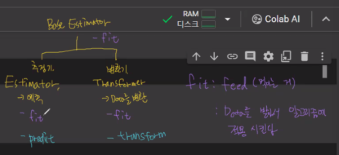

# 머신러닝(기계학습) 개념
준비물: Google Colab
    - 환경에 따라 설정하는게 다르기에 하나의 통일된 환경에서 사용함
    - 우리가 코딩을 하면 구글의 서버내에서 돌아감
실습자료: [구글드라이브/머신러닝](https://drive.google.com/drive/folders/1yGzGY5qCd3g5Cc1NEMMQd8AJ5MA-TSx-?usp=drive_link)

## 머신러닝의 개념
기계가 데이터로부터 학습을 함. 이에 학습에 있어서는 명시적인 프로그래밍 없음   
애플리케이션을 수정하지 않아도 데이터를 기반으로 패턴을 학습하는 알고리즘
- 여기서 프로그래밍이란 x를 라는 데이터를 받아 f(x) 함수를 실행시켜 y라는 결과를 내뱉는 것을 의미함
- 그래서 우리가 알고리즘을 배우는 이유가 머신러닝 내에서 발생한는 일에 대한 문제해결을 위해 알고리즘을 짜주고 머신러닝은 그 알고리즘을 통해 학습을 함

**머신러닝 vs 기존 컴포터 사이언스(코딩)**
- 코딩은 로직을 미리 만들어서 데이터를 받아 결과를 확인하는 방식
- 머신러닝은 특성 데이터와 결과를 넣어 로직을 머신이 학습하는 방식
  - 컴퓨터에 문제집만 주는 방식으로 니가 알아서 공부해 라는 것
  - 즉, 머신러닝 모델에 문제 데이터와 정답 데이터를 반복적으로 넣어주면 입력된 데이터의 패턴을 파악해 어떤 연산이 이뤄질지를 학습하게 됨

### 머신러닝의 유형
1. 지도 학습(Supervised Learning)
   - 머신러닝 모델에게 문제(feature)와 답(label)을 모두 제공
   - 정량적인 평가가 가능
   - 분류, 회귀, 추천 시스템, 시각/음성 감지 인지 등 
        1. 분류(Classification) : 이산문제(셀수 있는 자연수만을 취하는 변수)_Discreate(Categorical) Valued Output을 예측하는 문제
            - 이분변수(Binary Classification): 0 또는 1
            - 다분변수(Multi-Class Classification): 여러 카테고리 중 하나
        2. 회귀(Regression) 
           - 연속변수(실수값을 취할수 있는 변수_Continuous Valued Output) 예측

2. 비지도 학습(Un-Supervised Learning)
   - 비지도 학습은 머신러닝 모델에게 문제(feature)만 제공
   - 사람이 결과(성능)를 우선 파악을 다 해야함
   - 군집화(클러스터링), 차원 축소, 토픽 모델링, 문서 군집 등

    ** 문제(feature): 데이터(input)의 특징
 
### 머신러닝의 단점
사실 단점이라기 보다 우리가 신경을 써야하는 것
1. 데이터에 너무 의존적
    - EDA를 통해 내가 가지고 있는 데이터가 괜찮은 데이터인지 파악을 해야함
2. 학습시에 최적의 결과를 도출하기 위해 수립된 머신러닝 모델은 실제 환경 데이터 적용시 과적합 되기 쉬움
3. 복잡한 머신러닝 알고리즘으로 인해 도출된 결과에 대한 논리적인 이해가 어려울 수도 있음
4. 데이터만 집어 넣으면 자동으로 최적화된 결과를 도출할 것이라는 것은 환상
    - 끊임없이 모델을 개선하기 위한 노력이 필요
    - 데이터의 특성을 파악하고 최적의 알고리즘과 파라미터(인수)를 구성할 수 있는 고급 능력이 필요

## 사이킷런
머신러닝 아디다스라고 불리는 머신러닝을 하기위한 가장 대중적인 라이브러리 브랜드 
- 머신러닝을 위한 매우 다양한 알고리즘과 개발을 위한 편리한 프레임워크와 API를 제공
[사이킷런 기반 프레임워크]

### 머신러닝 용어
- Feature($X$)
  - (N*M)의 메트릭스
  - 학습해야할 데이터
  - 데이터 세트의 리반 속성
  - 항상 2차원 이상의 다차원 데이터에서 사용

- Label, Class, Target ($y$)
  - (N) 혹은 (N*1)형태의 벡터
  - 지도 학습 시 데이터의 학습을 위해 주어지는 정답 데이터
  - 분류에서는 타겟을 레이블로 지정
  - 회귀에서는 레이블을 타겟으로 지정
    - 즉, 레이블 타겟을 너무 구분해서 사용할 필요없음. 둘이 거의 비슷한 거라 생각하고 그냥 정답벡터라 보면 됨
  - class는 분류 문제에서 레이블의 종류를 의미
    - 그래서 분류에서만 사용되는 정답의 집합이라 생각해야함

#### 실습파일_01. 머신러닝 모델 생성

### 훈련 데이터 vs 테스트 데이터
> why? 데이터를 나눠서 사용할까?
1. 훈련 데이터
   - 머신러닝 알고리즘의 학습을 위해 사용
   - 데이터의 속성(feature)들과 결정값(target) 모두 가지고 있음
   - 훈련 데이터를 기반으로 머신러닝 알고리즘이 데이터 속성과 결정값이 패턴을 인지하고 학습
   - 즉, 데이터의 속성과 결정값을 목적에 맞게 패턴을 학습하는 것

2. 테스트 데이터
   - 훈련 데이터 세트에서 학습된 머신러닝 알고리즘을 테스트
   - 즉, 우리가 패턴을 잘 찾아냈는가 못찾아냈는가를 확인하는 것
   - 테스트 데이터는 속성 데이터만 알고리즘에 제공해서 결정값을 예측할 $\hat{y}$를 확인
   - 한마디로 테스트 데이터는 훈련 데이터와 별도의 데이터 세트로 제공되어야함
     - 훈련 데이터로 테스트하니까 잘나온다는 말은 걍 엉망진창이라는 것
     - 훈련은 훈련으로 테스트는 테스트로 특히! `지도학습`에서는 무조건 나눠야함

[질문!] 모든 테스트를 머신러닝 모델 훈련에 사용한다면?
이건 우리가 시험을 칠때 문제랑 답지를 같이주는 거나 마찬가지! 우리가 시험을 칠때도 개념을 잘 알고 있는지 확인하는 것으로 사실 이미알고 있는 데이터에 대한 평가는 의미가 없다. 
> 시험이라는 건 한번도 보지못한 데이터에 대해서 얼마나 잘 맞출수 있는지 평가하는 것 

- 한정된 데이터 내에서 데이터를 분할하여 새로운 데이터에 대해 얼마나 잘 예측할지를 가능해 볼수 있음
- 테스트 데이터 세트에 대한 오차를 `일반화 오차`라고 함
  - 일반화 오차: 모델의 궁극적인 목적으로 너무 과하지도 모자르지도 않게 예측을 하는 것
  - 너무 과하게 예측을 정확하게 하려는 과대적합 혹은 데이터의 추세만 신경쓰는 과소 적합을 피하기 위한 것

### train_test_split
```python
X_train, X_test, y_train, y_test = train_test_split(data, target, test_size=0.2, random_state=11, stratify)
```
- data : feature 데이터
- target : label 데이터
- test_size
  - 전체 데이터에서 테스트 데이터 세트의 비율
  - 기본값은 0.20로서 20%를 테스트 세트로 사용
- random_state와 stratify 둘중 하나 선택해서 사용
- random_state
  - train_test_split은 모든 데이터를 랜덤하게 섞고(shuffle) 분할(split)하기 때문에, 수행 시 마다 다른 데이터 세트가 생성될 수 있으므로 random_state를 이용해 난수 값을 고정
  - 만약 랜덤하지 않으면 훈련데이터에는 레이블이 0만 테스트는 1만남아 예측이 0%이 될 수 있음 
  - 아무 숫자를 넣어도 상관없으나 일반적으로 42를 많이사용(슈퍼컴퓨터가 세상의 마지막의 수를 42라고 한적이 있어서,,,)
- stratify
  - 데이터 분할 시 원본 데이터의 비율과 동일하게 테스트 세트를 생성하기 위해 지정하는 데이터 기준
  - 즉, 원본의 레이블 비율에 맞춰서 잘라주는 것으로 오로지 y의 비율만 생각하는 것
  - 물론 y뿐만이 아니라 분류에 있어서 어떤 feature($x_i$)가 크리티컬한 역할을 하는 것 같으면 $x_i$를 기준으로 나눠도 ㄱㅊ
    - 그러나, 이거때문에 y비율이 깨져버리면 안쓰는 것이 좋음. 
    - 왜냐면 학습을 안하는 것보다 그래도 학습을 하는 것이 중요하기 때문!!
  - 만약 레이블의 비율이 1:1:1처럼 거의 비등하면 굳이 stratify를 넣을 필요는 없음. 
    > 대부분의 상황에서는 stratify는 안해도 괜찮음 왜냐면 이미 거둘때 대충 비율을 맞춰서 우리가 하기때문! 너무 비율이 깨져있을때만 넣음!!

### 교차 검증
훈련 데이터 세트로 지지고 볶고를 다하고 난뒤 최종적으로 테스트 데이터 세트로 성능을 평가를 함
최종적으로 테스트를 하기전에 모의고사 개념으로 검증 데이터 세트(훈련데이터 세트에서 분할되서 나옴)를 만들어서 확인함
- 훈련 데이터내의 모든 데이터는 무조건 한번은 학습을 하고 검증도 한 데이터가 됨
- 검증 종류
    1. 일반 K 폴드(K-Fold) -> **회귀모델**에서 사용
        - 기계적으로 지정한 폴드 개수 k만큼 데이터를 나누는 방식
    2. 계층적 K 폴드(Stratified K Fold) -> **분류모델**에서 사용
        - 불균형한(imbalanced) 분포도를 가진 레이블(결정 클래스) 데이터 집합을 위한 K 폴드 방식
        - 학습 데이터와 검증 데이터 세트가 가지는 레이블 분포도가 유사하도록 검증 데이터 추출
> 하지만 이걸 굳이 따로따로 공부할 필요가 없음 왜냐면 우리에게는 간편화한 `Cross_val_score`이 있음!
>> K-Fold 클래스를 이용한 교차 검증 방법을 간편화 한 사이킷런의 검증 함수로 폴드 세트 추출, 학습/예측, 평가를 한번에 수행할 수 있음
```python
cross_val_score(estimator, X, y, scoring='accuracy', cv=3, n_jobs=1)
```
- estimator : 모델
  - estimator는 분류모델이 들어가면 자동으로 계층 폴드로 분석될 수 있도록 해줌 
- X : feature
- y : target
- scoring : 예측 성능 평가 방식
- cv : 폴드의 개수
- n_jobs : 사용할 cpu 개수 1개

### GridSearchCV
교차 검증과 최적 하이퍼 파라미터 튜닝을 한번에!
- 하이퍼 파라미터란?
  - 머신러닝의 개별적인 모델에 입력해야 하는 값(모델의 설정 값)
  - 즉, 모델이 학습하는 값이 아닌 개발자가 직접 넣어줘야 하는 값을 지칭
  - 개발자가 어떤 값을 넣느냐에 따라 모델의 성능이 조절되기에 모델 알고리즘의 최적 튜닝이 필요함
> GridSearchCV가 개발자가 전달한 파라미터에 대해 조합을 해서 각 조합별 폴드갯수를 곱해 전체 훈련 모델을 생성하고 교차검증까지도 해줌
>> 즉, 최적의 파라미터를 도출할 수 있음
- GridSearch를 수행하기 위한 하이퍼 파라미터 정의
  - 딕셔너리를 활용해서 정의
  - 딕셔너리의 key : 하이퍼 파라미터의 이름(하이퍼 파라미터의 변수명)
  - 딕셔너리의 value : 하이퍼 파라미터에 들어갈 **값의 목록**(리스트로 정의)
```python
GridSearchCV(estimator, param_grid=parameters, cv, refit=True, return_train_score=True, n_jobs=-1)
```
- estimator : 모델
- param_grid 
  - 하이퍼 파라미터의 목록이 들어있는 딕셔너리, 여러 개의 딕셔너리를 이용할 수도 있음
  - 즉, GridSearch를 수행하기 위한 파라미터 목록을 전달
- cv : 각 하이퍼 파라미터 조합으로 만드는 모델에서 사용할 폴드의 개수
- refit : True로 설정하면 가장 좋은 파라미터 설정으로 재학습 시킨다.
- return_train_score : 훈련 세트에 대한 평가 점수도 같이 확인하게 해 주는 옵션
- n_jobs=-1 : 사용 가능한 CPU 코어를 모두 사용


#### 실습파일_02.model_selection

```
[정리]
1. 가져온 데이터 훈련/테스트 데이터로 분할
2. 훈련데이터로 학습
3. 테스트 데이터로 테스트하여 일반화 점수확인하기
4. 훈련데이터(훈련데이터+검증데이터)로 학습 하면서 검증도 같이해야함(aka 모의고사)
5. GridSearchCV를 통해 모델을 설정할수 있는 하이퍼파라미터 목록들을 나열해 놓고 최고의 성능을 낼 수 있는 모델을 추출
```

## 데이터 전처리
데이터를 수집하면 가장먼저하는 것으로 EDA, 중복 제거, NaN 처리 등 다양한 방법이 있음
- Feature Engeneering의 대표적인 방법으로 `표준화, 정규화, 인코딩`이 있음

### 인코딩(En + Coding)
코드(컴퓨터가 알아들을 수 있는 정보) 형식으로 만드는 과정
문자열 데이터를 숫자값으로 변환/인코딩 되어야함
- 여기서 모든 문자열이 아닌 category형 문자형만 인코딩이 가능함(Id형, 대화형 문자열 제외)
- 방법
  1. 레이블(Label) 인코딩
    - y가 문자열인 경우 y를 바꿔주는 것
    - feature에서도 사용하고싶으면 사용이 가능하지만, 의미가 별로 없으므로 하지말것!
    - 카테고리문자형을 정수형으로 바꿔주는 것
  2. 원-핫(One-Hot) 인코딩
    - x, y 모두에 적용가능
    - y에 적용하는 순간은 사실 딥러닝할때밖에 없음!
    - Feaure의 유형에 따라 새로운 Feature를 추가해 고유 값에 해당하는 컬럼에만 1을 표시
    - 데이터 전처리 할때 변수의 개수별로 더미변수를 만들어 주고 나중에 통계분석이나 필요시에 n-1을 해야함
  > 즉, 열이 추가되는 거고 해당되는 값에 1을 주고 아닌 값에 0을 줌
  >> 더미변수
    - 하지만 카테고리가 너무 많을 경우 더미변수가 너무 많이 생성된다는 단점이 있음
      - 이를 보완하고자 넘파이에서는 Compressed Sparese Row Format을 지원해 하나의 열에 (행, 열)을 표시

### Base Estimator 분류
- fit = feed(먹이는 것)   
data를 받아서 알고리즘에 적용
 - 하지만 변환기의 fit은 data를 변환할 준비를하는것으로 mapping하는 것으로 볼 수 있음
- predict와 transform의 공통된 특징은 알고지름이 해석한 결과값을 줌
- 하지만 변환기의 fit의 경우는 내부적으로 적용을 했을뿐이지 사용자에게 주지않음. 
 - 즉, transform은 니가 fit에서 받은 데이터를 사용자가 볼수 있게 변환해줘라는 의미가 되는것
 - `fit_transform()`은 데이터를 입력 받고, 입력 받은 데이터를 바로 변환
  <p align="center">
    
  </p>

### 표준화 & 정규화
feature을 변환하는 것으로 2차원 배열로 세팅하고 계산해야함
1. 표준화_중심을 0으로
   - 데이터의 feature 각각이 평균이 0이고 분산이 1인 가우시안 정규 분포(표준정규분포)를 가진 값으로 변환
   - 즉, 평균값에 개수가 가장많고 평균에서 멀어질수록 적어지는 종모양의 분포!
   - 데이터 분포의 중심을 0으로 변경.(Zero-Centered)
    - 단위가 다른 데이터들을 평균:0, 분산:1로 맞춰줘서 모든 데이터의 중심을 똑같이 맞춰서 안정적인 예측이 가능
   > 선형모델에서는 무조건 쓰는 변환방식!
$$
x_i=\frac{x_i-\mu}{\sigma}
$$

2. 정규화_항상 0~1
   - 데이터의 분포는 유지한채로 단위를 항상 0~1로 압축(?) 해주는것
   - 데이터의 단위가 최대, 최소가 정해져있는 경우 해주는 것이 편함
   - 표준화는 같은 선상에 놓고 본다는 컨셉으로 정규화는 공평하게 보자라는 개념으로 사실 표준화를 고려해도 상관은 없음
     - 일반적으로 표준화를 먼저 해보고 잘안나오면 한번 정규화를 해줌
   > 사실상 거의 잘 안쓴다 생각하면 편함 
$$
x_i=\frac{x_i-min(x)}{max(x)-min(x)}
$$

#### 실습파일_03. 데이터 전처리