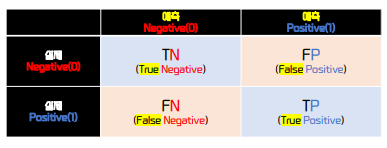
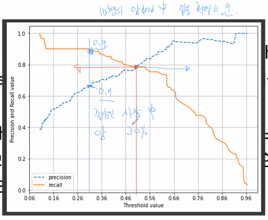
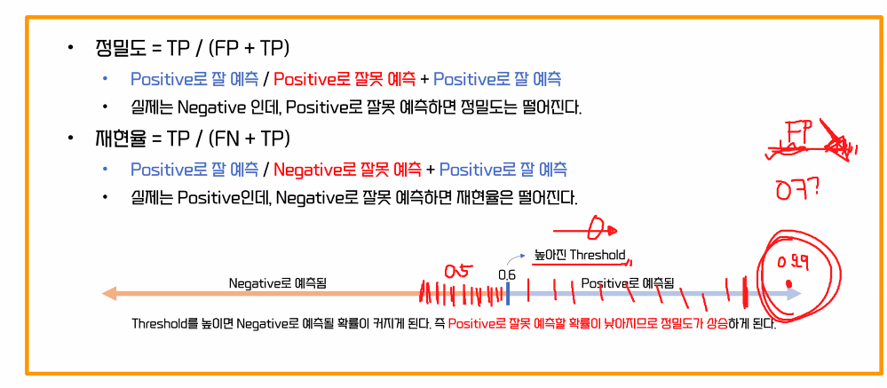

# 분류 모델 평가 방법
## 평가
### 분류 성능 평가 지표
**1. 정확도(Accuracy)**   
    예측 결과가 동일한 데이터 건수 / 전체 예측 데이터 건수
   - 데이터가 많으면 틀린 개수가 많아도 정확도가 높을 수 있음   
   (예시) 100,000개중에 1,000개가 틀려도 정확도는 99%로 높을수 있음. 이처럼 데이터가 많을수록 틀린 데이터 개수가 많아지는데 과연 정확도가 높은게 무조건 정답일수 있을까? -> 놉!
   - 이진분류를 할때는 구성의 성능에 따라 제대로 평가하기가 어려울 수 있음
   - 오류: 데이터의 양의 문제도 있지만 모델없이 임의의 y값 모두 0으로 해도 정확도는 90%가 나옴

**2. 오차행렬(Confusion Matrix)**
    

        
    

    이처럼 정확도로는 확인하기 어려워 오차행렬에서 계산가능한 `정밀도, 재현율, F1 Score` 값을 확인함

**3. 정밀도(Precision)**
   - 모델 양성 P의 적중률
   - 실제 음성을 양성로 잘못 예측하면 FP가 올라서 정밀도가 내려감
$$
정밀도(Precision) = \frac{TP}{FP+TP}
$$

**4. 재현율(Recall)**
   - 실제 양성 비율
   - 실제 양성을 음성으로 잘못 예측하면 FN이 올라서 재현율이 내려감 
$$
재현율(Recall) = \frac{TP}{FN+TP}
$$

**5. F1 Score**  
최고로 잘한거는 완벽하게 양성, 음성을 맞추는것으로 재현율, 정밀도가 둘다 1로 나오는 것이 좋음   
그러나 재현율과 정밀도는 반비례관계로 둘다 1이 나오긴 어려우니 적절한 교차점을 찾는 것이 좋음
- 즉, F1 Score 정밀도와 재현율을 결합한 지표로 정밀도와 재현율의 균형(balance)이라 할 수 있음
- 정밀도나 재현율쪽 한쪽으로 치우쳐지면 F1-Score값이 낮아지는걸 볼 수 있음
$$
F1=\frac{2}{\frac{1}{recall}+\frac{1}{precision}}
=2\times\frac{precision\times{recall}}{precision+recall}
$$ 

### 업무에 따른 재현율과 정밀도의 상대적 중요도와 트레이드 오프
> 재현율과 정밀도의 관계는 반비례 관계(trade-off)

트레이드 오프까지 신경써서 분석하고 모델링하면 더이상 머신러닝을 공부할 필요가 없을 정도로 분류에서는 여기가 최종단계
- 분류하려는 업무의 특성상 정밀도 또는 재현율이 특별히 강조돼야 할 경우 분류의 결정 `임곗값(Threshold)`을 조정해 정밀도 또는 재현율의 수치를 높일 수 있음
    - 데이터와 알고리즘을 통해 성능을 높이는 것은 한계가 있음
- 하지만 정밀도와 재현율은 상호 보완적인 지표이기 때문에 어느 한쪽을 강제로 높이면 다른 하나의 수치는 떨어지기가 쉽다는 것을 알고 들어갈 것

**임곗값(Threshold)이란?**
- 양성예측 확률
- 확률이 나오는 모델(로지스틱 회귀 분석) 있고 안나오는 모델이 있음
- 보통 1이 되는 기준 = 0.5
- 조작하는 법
  - 임계값을 0.4로 낮추면 FN을 낮고 TP가 오름. 이에 재현율이 올라감

    

**1. 재현율(Recall)이 상대적으로 더 중요한 지표인 경우**
- 실제 Positive 데이터 예측을 Negative로 잘못 판단하면 업무상 큰 영향이 발생하는 경우
- 암 진단, 금융 사기 판별   
- 재현율을 높이기 위해 FN을 낮춰야함. 대신 FP가 올라가게 되는데 FP가 올라가도 상관없는 상황   
(예시) 구체적인 FN의 상황이 뭘까?   
-> 암환자가 왔는데 의사가 잘못 종양(0)으로 잘못 예측해서 암(1)이 아니라고 함 
  - 즉, 환자가 암인데 종양으로 예측하는게 더 위험하니 그냥 모든 환자를 암(양성, 1)으로 예측하도록 종양(음성, 0)으로 예측하는 성능을 낮추는것!

**2. 정밀도(Precision)가 상대적으로 더 중요한 지표인 경우**
- 실제 Negative 데이터 예측을 Positive로 잘못 판단하면 업무상 큰 영향이 발생하는 경우
- 스팸 메일
- 정밀도를 높이기 위해 FP를 낮춰야함, 대신 FN이 올라가게 되는데 FN이 올라가도 상관없는 상황
(예시) 구체적인 FP의 상황이 뭘까?    
-> 입사계약서(0)를 스팸(1)으로 처리해서 스팸메일로 처리되어 입사 서명을 못함 
  - 즉, 스팸은 매일 받아도 못받은게 큰 문제가 생기지는 않아 상관없으나 만약 모든 메일이 오면 일반 메일(0)로 먼저 받고 확인 한 뒤 스팸 메일(1)로 처리팸(1)메일로  양성으로 예측하는 성능을 낮춰야함

> 모델의 양성, 음성 예측 기준을 설정해 잘못된 예측값(FP, FN)을 조정하는 것

### 정밀도/ 재현율을 100로 만드는법
- 재현율 100%
  - FN이 0이면 되므로 임계값을 최대로 낮춤
  - 즉, 암환자의 예시의 경우 임계값을 낮춰서 종양을 전부 암이라고 말하고 암환자를 암이라 하는 것이 좋음
    

        
    

- 정밀도 100%
  - FP가 0이면 되므로 임계값을 최대로 높임
  - 전부 1로 예측을 해버리면 양성을 맞추게 되는것
  - 왜냐면 올리면 올릴수록 확실한 애들만 1이 되므로 FP가 되는 확률이 떨어지기 시작함
    - 왜냐면 양성으로 예측 자체를 안하기 때문

#### 실습파일_04. 분류모델 평가 방법