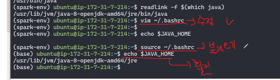

# 프로그램 설치

## 인스턴스란?
- 보안   
ec2에 접근하기 위해서는 .pem 파일이 필요하지만,
ec2에서 만든 서버에는 .pem이 없어도 접근할 수 있음

## 파이썬 및 주피터 노트북 개발환경 구축
[참고링크](https://radial-fighter-931.notion.site/Python-c219574fd69e431f8c5ce80490ebf4f2)
aws가 실행된 환경(ubuntu@ip-172-31-11-147:~$ )에서 실행
1. 미니콘다 설치 -> 아래 코드 실행
   - wget https://repo.anaconda.com/miniconda/Miniconda3-latest-Linux-x86_64.sh
2. 미니콘다 설치를 다하면 bash파일을 실행
   - bash Miniconda3-latest-Linux-x86_64.sh
   - 약관 동의가 나오는데 계속 엔터키 누르기(혹은 q누르면 맨밑으로 내려감)
   - yes/no 질문에 전부 yes 누르기
3. sourch를 통해 .bashrc불러오기
   - ubuntu@ip-172-31-33-75:~$ source ~/.bashrc
   - 실행 결과 아래와 같이 이름이 바뀜
     - (base) ubuntu@ip-172-31-11-147:~$
4. (base) ubuntu@ip-172-31-11-147:~$에서 python 위치 확인해보고 잘되었는지 확인
   - which python
5. 이제 juypyter Notebook 설치 하기전 가상환경 실행하기
   - (base) ubuntu@ip-172-31-11-147:~$ conda create -n spark-env python=3.8
     - yes/no에서 yes 누르기
6. 설치한 후 spark-env 실행
   - (base) ubuntu@ip-172-31-11-147:~$ conda activate spark-env
7. 6번을 실행하면 (spark-env) ubuntu@ip-172-31-11-147:~$ 으로 바뀜. 여기서 jupyter notebook 설치
   - pip install notebook==6
8. 파이썬 실행하기
   - (spark-env) ubuntu@ip-172-31-11-147:~$ python
8. 파이썬이 실행되면 >>>가 뜨는데 거기에 아래 코드 실행하기
   - ``` >>> from notebook.auth import passwd```
   - ``` >>> passwd()```
   - 비밀번호 입력하기
   - 비밀번호 설정을 완료하면 아래코드가 나오는데 메모해두기
     - sha1:90d53d84d759:e32d5cd277594a998216f02a1ee012f9114b4539
9. 파이썬 끄기 : `ctrl + D`
    - 파이썬 종료하면 다시 아래 이름으로 나와짐
      - (spark-env) ubuntu@ip-172-31-11-147:~$ 
10. 아래 코드 실행
    - jupyter notebook --generate-config
11. 10번이 성공하면 아래 코드 실행해서 파일을 열어주기
    - sudo vim /home/ubuntu/.jupyter/jupyter_notebook_config.py
      - 참고로 window10Rkwlsms
12. 파일이 열린것을 확인한 후 `i`를 입력해 INSERT 모드로 만들어주고 C = get_config()아래에 아래 코드 입력
    ```
    c.NotebookApp.password = u'argon으로 시작하는 비밀번호'
    c.NotebookApp.ip = 'EC2 내부 IP'
    c.NotebookApp.notebook_dir = '$your_notebook_root_dir_path'
    ```
    - 여기서 아래 처럼 몇몇 정보를 바꿔야함
      - argon으로 시작하는 비밀번호 = 과정 8번에 메모한 코드 넣기 
      - EC2 내부 IP = 내 인스턴스 프라이빗 IPv4 주소 넣기
      - 
    ```
    c.NotebookApp.password = u'sha1:90d53d84d759:e32d5cd277594a998216f02a1ee012f9114b4539'
    c.NotebookApp.ip = '172.31.11.147'
    c.NotebookApp.notebook_dir = '/home/ubuntu/working'
    ```
13. 다하면 esc버튼 누르고 :wq 입력해서 벗어나기
14. 아직 우린 working 파일이 없어서 만들어 주기
    - mkdir working
15.  jupyter notebook 서버를 실행
    - jupyter notebook --allow-root
      - 실행하다면 노란색 뭐가 뜨는데 그냥 무시 ㄱㄱ
16. 끝!

### 설치한 노트북 입력해보기
- 기존에는 노트북에서 실행해서 local/host888? 같은걸로 주피터노트북을실행을 했다면
- 이제는, 노트북서버를 ec2에 접속을 할 수 있게 퍼블릭 아이피, 포트번호를 사용
1. 구글 크롬 새창에 `퍼블릭 IPv4 DNS` + `:8888` 입력
2. 비밀번호 입력 하면 주피터 화면이 잘 나옴!


## Java 개발환경 구축
- 대부분의 빅데이터 툴이 Java기반으로 되어있어 해보는 것을 추천
- `(spark-env) ubuntu@ip-172-31-11-147:~$` 환경에서 시작!
1. 자바 설치전 업데이터 먼저해주기
   - sudo apt-get update
   - sudo apt-get upgrade
     - yes 입력해주기
2. OpenJDK 8 실행 설치
   - sudo apt-get install openjdk-8-jdk -y
3. `java -version`을 입력하여 자바가 잘 설치되었는지 확인
   - 아래 결과가 나오면 잘된거임
    ```
    openjdk version "1.8.0_362"
    OpenJDK Runtime Environment (build 1.8.0_362-8u372-ga~us1-0ubuntu1~20.04-b09)
    OpenJDK 64-Bit Server VM (build 25.362-b09, mixed mode)
    ```
4. `readlink -f $(which java)`를 입력해 실제 자바 설치 위치를 확인
   - which 함수를 사용해 java의 경로를 찾음
     - /usr/lib/jvm/java-8-openjdk-amd64/jre/bin/java
   - 이 경로를 복사해서 환경 변수에 등록하기
5. 환경변수를 등록하기 위해 `vim ~/.bashrc`를 실행
6. 새로운 창이뜨면 shift + g를 해서 맨아래칸으로가서 i를 입력해 INSERT환경으로 바꿔 아래 환경변수를 입력해주기 
    ```
    # JAVA_HOME
    export JAVA_HOME=/usr/lib/jvm/java-8-openjdk-amd64/jre
    export PATH=$PATH:$JAVA_HOME/bin
    ```
   - JAVA_HOME이 환경변수로 대문자로해줌
     - 예를 들어 하둡을 깔면은 HADOOP_HOME
     - 스파크를까렴 SPARK_HOME으로 환경변수 입력
7. 입력후 `ESC`를 눌러 명령어 모드로  진입한 후 `:wq`를 누르고 나오기
8. 가상환경에서 `echo $JAVA_HOME`을 누르면 아무런 창이 뜨지않음. 이에 `source ~/.bashrc`를 입력해  (base) ubuntu@ip-172-31-11-147:~$의 환경으로 바꾼뒤 다시 `echo $JAVA_HOME`를 입력하면 자바 경로가 잘 설정된것을 볼 수 있음
    <p align="center">
      
   </p>
```
[번외]
echo는 단순히 출력을 하겠다는 명령어 이기 때문에 .bashrc에 기록된 내용 말고 다른 쪽에 있는 환경변수나 다른 값들도 확인하는 것이 가능합니다~!

그런데 기본적으로 대부분의 환경변수는 bashrc에 기록하기 때문에 echo로 보는 환경변수는 대부분 .bashrc에 있는 것이라고 생각하면 될 것 같아요!
```

## Visual Studio Code 연동하기
이건 충분히 강사님 설명잘되어 있어서 아래 링크 참고하기    
[참고](https://radial-fighter-931.notion.site/AWS-2b3e5feb815e45e5b799dd7e332d0db8#faff7bc84b8a40b08ada86084e12f112)

1. Remote - SSH, Remote -SSH: Editing Configuration Files 확장 모듈을 설치
2. 왼쪽 밑 >< 파란색 아이콘 클릭
3. connet to Host 클릭
4. configure SSH Hosts 클릭
5. 맨위 C:\Users\user\/ssh\config 클릭
6. config화면이 뜨면 기존에 있는 화면 지우고 새로 입력
   ```
   Host 커넥션이름(아무거나 지정해도됩니다. 단, 띄어쓰기는 하지마세요)
    HostName AWS Public IP 주소
    User ubuntu
    IdentityFile ~/.ssh/key파일이름.pem
   ```
   - 위의 내용을 아래처럼 입력
   ```
   Host AWS_MULTI
    HostName ec2-3-114-30-206.ap-northeast-1.compute.amazonaws.com
    User ubuntu
    IdentityFile ~/.ssh/V-lab.pem
   ```
   - 다하면 저장
7. 다시 왼쪽 밑 >< 파란색 아이콘 클릭
8. connet to Host 클릭
9. 새로 뜬 AWS_MULTI 클릭
10. 새로운 창이 뜨고 LINUX 클릭
11. 성공적으로 연결이 된 후 파일 목록에서 Open Folder를 눌러보면 다음 처럼 원격 연결된 ec2의 디렉토리 목록을 확인할 수 있음
12. 끝!


## Haddop
`(base) ubuntu@ip-172-31-11-147:~$` 환경에서 시작
### 하둡 설치하기
   1. `wget https://dlcdn.apache.org/hadoop/common/hadoop-3.2.4/hadoop-3.2.4.tar.gz`
      - `ls`로 다운 잘됐는지 확인(결과물에 hadoop-3.2.4.tar.gz 이가 있어야함)
   2. `tar xvfz hadoop-3.2.4.tar.gz` : 압축해재하는 기능
   - `ls`로 확인(hadoop-3.2.4)
   3. `vim ~/.bashrc`로 들어가서 환경변수 등록해주기
      - 가장 아래에 들어가서(shift+G) 아래 코드 입력해주기
         ```XML
         export HADOOP_HOME=/path/to/hadoop-3.2.4
         export PATH=$PATH:$HADOOP_HOME/bin
         ```
         - 여기서 /path/to/는 본인 컴퓨터상의 환경으로 새로 입력
         ```XML
         export HADOOP_HOME=/home/ubuntu/hadoop-3.2.4
         export PATH=$PATH:$HADOOP_HOME/bin
         ```
   - `ESC`를 누르고 `:wq`로 저장후 나오기
   - `echo $HADOOP_HOME`로 잘 저장되었는지 확인하기
### ssh로그인 설정하기
   - ssh를 왜설정하나?
     - A컴퓨터에서 B컴퓨터에 접근할때 ssh(열쇠)를 사용해 자물쇠를 따는것
     - 키박스에 키를 넣어둬 이걸 가지고 있는 사람이 자동문마냥 통과 할수 있도록 해줌
   - `ssh-keygen -t rsa -P '' -f ~/.ssh/id_rsa`로 키를 생성
   - `ls ~/.ssh/`로 authorized_keys, id_rsa, id_rsa.pub 이 세개가 나오는지 보기
   - `cat ~/.ssh/id_rsa.pub >> ~/.ssh/authorized_keys`로 키를 키박스에 넣어두기
   - `chmod 0600 ~/.ssh/authorized_keys`로 이컴퓨터에서만 읽고, 쓰기만 할수 있게 해주기
   - 다하면 `ssh localhost`를 해서 잘 통과되는지 확인하기
     - yes/no질문에 yes로 하기
     - `exit`로 해서 나오고 다시 `ssh localhost`하면 바로 들어가는 것을 볼 수 있음
   - 끝!
   - 참고로 `w`를 하면 내가 어디이고 어떤 상태인지 볼 수 있음

### 하둡 설정하기
   1. `cd $HADOOP_HOME/etc/hadoop/`로 폴더로 들어가기
   2. `ls`로 파일들 잘 있는지 확인
   3. core-site.xml 설정
      - `vim $HADOOP_HOME/etc/hadoop/core-site.xml`를 입력해 네임노드를 띄울 서버만 지정
      - 아래 코드를 맨 아래에 입력하기
      - AWS 퍼블릭코드 수정 필요함
      ```XML
      <configuration>
      <configuration>
         <property>
                  <name>fs.defaultFS</name>
                  <value>hdfs://ec2-3-114-30-206.ap-northeast-1.compute.amazonaws.com:9000</value>                   
         </property>
      </configuration>
      </configuration>
      ```
      - 다하면 `:wq`로 저장후 나오기
   4. hdfs-site.xml 설정
      - `vi $HADOOP_HOME/etc/hadoop/hdfs-site.xml`를 입력해 hdfs에 관련된 설정들을 작성
      - 아래 코드로 입력
      - 이때 내 AWS 퍼블릭 아이디 집어넣는거랑, 경로 조심하기
      ```XML
      <configuration>
         <property>
            <name>dfs.replication</name>
            <value>1</value>
         </property>
         <property>
            <name>dfs.namenode.name.dir</name>
            <value>/home/ubuntu/hadoop-3.2.4/dfs/name</value>
         </property>
         <property>
            <name>dfs.datanode.data.dir</name>
            <value>/home/ubuntu/hadoop-3.2.4/dfs/data</value>
         </property>
         <property>
            <name>dfs.namenode.http-address</name>
            <value>ec2-3-114-30-206.ap-northeast-1.compute.amazonaws.com:9870</value>
         </property>
      </configuration>
      ```
   5. `cd ~`를 하고 홈으로 나오기
   6. `mkdir -p $HADOOP_HOME/dfs/name`로 파일생성
   7. `mkdir -p $HADOOP_HOME/dfs/data`로 파일생성
   8. `ls $HADOOP_HOME/dfs`로 data랑 name 파일 만들어 졌는지 확인
   9. yarn-site.xml 설정
      - `vi $HADOOP_HOME/etc/hadoop/yarn-site.xml`
      - 아래코드 넣기. 
      - AWS 퍼블릭코드 수정 필요함
         ```XML
            <property>
               <name>yarn.nodemanager.aux-services</name>
               <value>mapreduce_shuffle</value>
            </property>
            <property>
               <name>yarn.nodemanager.env-whitelist</name>
               <value>JAVA_HOME,HADOOP_COMMON_HOME,HADOOP_HDFS_HOME,HADOOP_CONF_DIR,CLASSPATH_PREPEND_DISTCACHE,HADOOP_YARN_HOME,HADOOP_HOME,PATH,LANG,TZ,HADOOP_MAPRED_HOME</value>
            </property>
            <property>
               <name>yarn.resourcemanager.webapp.address</name>
               <value>ec2-3-114-30-206.ap-northeast-1.compute.amazonaws.com:8088</value>
            </property>
            <property>
               <name>yarn.nodemanager.webapp.address</name>
               <value>ec2-3-114-30-206.ap-northeast-1.compute.amazonaws.com:8042</value>
            </property>
         ```
   10. mapred-site.xml 설정
      - `vi $HADOOP_HOME/etc/hadoop/mapred-site.xml`
      - 아래코드 수정없이 삽입
         ```XML
            <property>
               <name>mapreduce.framework.name</name>
               <value>yarn</value>
            </property>
            <property>
               <name>mapreduce.application.classpath</name>
               <value>$HADOOP_MAPRED_HOME/share/hadoop/mapreduce/*:$HADOOP_MAPRED_HOME/share/hadoop/mapreduce/lib/*</value>
            </property>
               <property>
                     <name>yarn.resourcemanager.webapp.address</name>
                     <value>0.0.0.0:8088</value>
               </property>
               <property>
               <name>mapreduce.jobhistory.webapp.address</name>
               <value>0.0.0.0:19888</value>
            </property>
         ```
   11. hadoop-env.sh 설정
      - `vim $HADOOP_HOME/etc/hadoop/hadoop-env.sh`
      - 아래 코드 그냥 맨 아래에 삽입
         ```XML
         JAVA_HOME=/usr/lib/jvm/java-8-openjdk-amd64/jre
         ```

### HDFS 실행
   1. `hdfs namenode -format`실행해서 포멧진행!
   2. `$HADOOP_HOME/sbin/start-dfs.sh`로 하둡실행! 그냥 외우기⭐⭐⭐
   3. `jps`를 실행해서 네임노드와 데이터노드, 세컨더리 네임노드가 정상적으로 실행됐는지 확인
      - 아래처럼 나오면 끝! 나와야함
         ```Bash
         11136 NameNode
         11641 Jps
         11532 SecondaryNameNode
         11295 DataNode
         ```
   4. 나의 `AWS퍼블릭아이디 DNS:9870`을 구글 탭에 입력하면 hdfs의 web ui도 볼 수 있음
      - 하둡을 관리하고 요약을 보고싶으면 이페이지 만한게없음
        - :9864
        Data Node_실무자들을 한번에 볼수 있음
        - Utilities > Logs
          - 노드별로 로그가 계속 쌓이는데, 무슨 에러인지 정보가 다 담겨있음
          - `IOException`이 Java에서 에러표시를 나타내는것으로 생각하면 에러찾기가 수월함

### YARN 실행
1. `$HADOOP_HOME/sbin/start-yarn.sh`실행
2. `jps`를 실행해서 ResourceManager랑 NodeManager가 잘뜨는지 확인
3. 리소스 매니저를 위한 UI도 따로 제공
   - `AWS퍼블릭아이디 DNS:8088`을 구글탭에 입력
   - 작업하다 잘 안되면, Resource를 많이봄

### JobHistroyServer 실행
1. `mapred --daemon start historyserver`실행
2. `jps`를 실행해서 JobHistoryServer확인
3. 작업 내역을 확인할 수 있는 UI를 확인
   - `AWS퍼블릭아이디 DNS:19888`

### 맵리듀스 예제 실행
구글탭 세개(9870, 8088, 19888)모두 키고 진행!
1. 원주율 구하는 `hadoop jar $HADOOP_HOME/share/hadoop/mapreduce/hadoop-mapreduce-examples-3.2.4.jar pi 16 10000`코드 실행!
2. 9870에서 Utilites를 보면 log가 있는데, 이때 이 로그를 통해서 각 프로세스의 과정과 오류를 다 확인할 수 있음
3. 8088을 재실행하면 새로운 작업이 보임.
   - 왼쪽 Finished를 누르면 어떤 어플리케이션이 실행됬는지 정보를 볼 수 있음
4. 19888도 재실행해 작업을 세부적인 작업내역을 볼 수 있음

### 프로세스를 종료
- 실행과정: 
  1. dfs(`$HADOOP_HOME/sbin/start-dfs.sh`) 
  2. yarn(`$HADOOP_HOME/sbin/start-yarn.sh`) 
  3. js(`mapred --daemon start historyserver`)
- 끄는과정: 실행과정 반대!
  1. js(`mapred --daemon stop historyserver`)
  2. YARN(`$HADDOP_HOME/sbin/stop-yarn.sh`)
  3. dfs(`$HADDOP_HOME/sbin/stop-dfs.sh`)
- 만약에 이런 과정이 귀찮다면 `$HADOOP_HOME/sbin/stop-all.sh`코드로 한번에 삭제후 `mapred --daemon stop historyserver`를 실행하면 아무것도 없는 걸 볼 수 잇음

### 하둡 자체적으로 삭제
`rm -r hadoop-3.2.4`
