# [KDT_이러닝] 최적의 코딩을 결정하는 기본 알고리즘

## 스택
먼저 들어온 데이터가 나중에 나가증 형식(선입후출)의 자료구조
- 입구와 출구가 동일한 형태
- 가장 먼저들어온데이터가 왼쪽부터 시가해서 새로들어온데이터가 오른쪽방향으로 쌓임
- (예시) 박스쌓을때 나중에 올리는 박스가 맨위에 있어서 다시 박스를 내릴때 맨위에 있는 박스를 다시 옮기는것
- 구현예제
  - `stack = []` 리스트 형태로 삽입
  - `stack.append` 가장 오른쪽에 데이터를 삽입
  - `stack.pop()` 가장 오른쪽의 데이터를 꺼냄
  - `stack[::-1]` 최상단 원소부터 출력 -> 가장 먼저 들어온 데이터부터 표시하고 싶을때 사용([1, 2, 3, 4])
  - `stack` 최하단 원소부터 출력 -> 가장 나중에 들어온 데이터부터 표시([4, 3, 2, 1])

## 큐
먼저 들어 온 데이터가 먼저 나가는 형식(선입선출)의 자료구조
- 입구와 출구가 모두 뚫려 있느 터널과 같은 형태 -> 공평한 자료구조
- 가장 먼저 들어온 데이터가 왼쪽으로 새ㅀ 들어온 데이터에 의해 오른쪽으로 밀리면서 쌓임
- (예시) 은행창구에서 먼저들어온 손님이 먼저 상담을 받는 것
- 구현예제
  - `from collections import deque` 라이브러리 사용
    - 리스트 자료를 이용해서 큐를 구현할수는 있지만 시간복잡도가 더 높아 비효율적으로 사용될 수 있음
  - `queue = deque()` 즉, 맨처음 시작할때 deque()를 생성
  - 앞서 큐를 설명한거와 달리 구현 예제에서 코드는 반대로 오른쪽에 데이터를 삽입하고 왼쪽의 데이터를 꺼내는 것을 볼 수 있음. 그러나 선입선출은 지킨다는 것을 기억해야함
    - `queue.append` 가장 오른쪽에 데이터를 삽입
    - `queue.popleft()` 가장 왼쪽의 데이터를 꺼냄
  - `queue.reverse()` 원소를 역순으로 바꾸기

### 우선순위 큐
우선순위가 가장 높은 데이터를 가장 먼저 삭제하는 자료구조
- 데이터를 우선순위에 따라 처리하고 싶을 때 사용
- (예시) 물건 데이터를 자료구조에 넣었다가 가치가 높은 물건부터 꺼내서 확인해야 하는 경우
- 구현 방법
    1. 리스트를 이용하여 구현하는 것
    2. 힙(heap)을 이용하여 구현
        - O(NlogN)_힙과 같은 경우는 단순히 N개의 데이터를 힙에 넣었다가 모두 꺼내는 작업이 정렬과 동일하다는 특징이 있음
    - 리스트는 넣을때는 단순히 넣지만은 우선순위를 찾을때는 일일히 찾아야한다는 점에 있어 시간복잡도가 높음

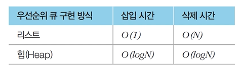

#### 힙
완전 이진 트리 자료구조의 일종
- 루트 노드(root node)제거 -> 즉, 루트 노드를 가장 먼저 꺼내는 것
  1. 최소 힙
    - 루트 노드가 가장 작은 값
    - 따라서 값이 작은 데이터가 우선적으로 제거됨
  2. 최대 힙
    - 루트 노드가 가장 큰 값
    - 따라서 값이 큰 데이터가 우선적으로 제거됨
- 완전 이진 트리란?   
루트 노드부터 시작하여 왼쪽 자식 노드, 오른쪽 자식 노드 순서대로 데이터가 차례대로 삽입되는 트리
- 힙 구성 함수
  - `Min-Heapify()`
    1. 상향식 : 작은 값이 부모노드가 아니라면 상향식 방식으로 부모 노드로 거슬러 올라가, 부모보다 자신의 값이 더 작은 경우 위치를 교체함
       - 즉, 새로운 원소가 삽입되더라도 항상 균형을 유지하기에 O(NlogN)의 시간 복잡도로 힙 성질을 유지 할 수 있음
    2. 하향식
       - 삽입이 아닌 원소가 제거될때 가장 마지막 노드가 루트 노드의 위치에 오도록함
       - 이후 힙의 성질을 만족 할 수 있도록 하향식으로 자식 노드와의 위치를 확인해서 자리를 잡아감
> 그렇기에 힙에서는 항상 동일한 구조를 제공하기에 데이터를 꺼낼때 시간 복잡도를 확보 할 수 있음
- 구현 예제
  - `import heapq` 라이브러리
    

        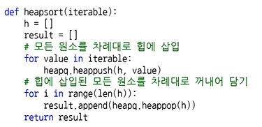
    

## 이진 탐색 트리
이진 탐색이 동작할 수 있도록 고안된 효율적인 탐색이 가능한 자료구조
- `왼쪽 자식 노드 < 부모 노드 < 오른쪽 자식노드` 순으로 데이터 값이 큼
- 데이터를 조회하는 과정
  - 이진 탐색 트리가 이미 구성되어 있다 가정하고 찾고자 하는 원소를 받음
    1. 루트 노드부터 방문하여 탐색을 진행
    2. 비교하는 노드와 찾고자 하는 데이터가 더 크면 오른쪽으로 방문
    3. 방문한 노드와 값을 비교했을대 찾고자 하는 데이터가 더 작으면 왼쪽을 방문
    4. 방문한 노드를 찾게 되면 탐색을 종료함
- 트리의 순회
    - 트리 자료구조에 포함된 노드를 특정한 방법으로 한 번씩 방문하는 방법
      1. 전위 순회: 루트를 먼저 방문
      2. 중위 순회: 왼쪽 자식을 방문한 뒤에 루트를 방문
      3. 후위 순회: 오른쪽 자식을 방문한 뒤에 루트를 방문
  - 구현 예제
    

        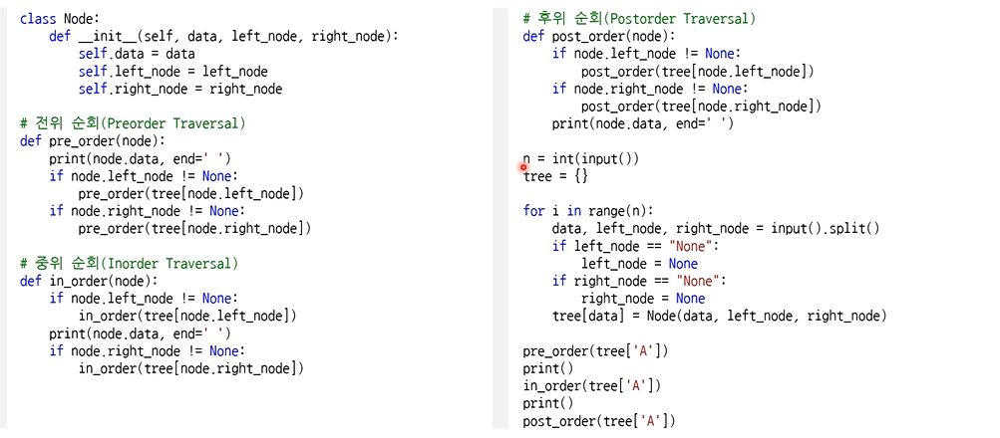
    

## 문제 풀이시 필요한 자료구조
**1. 바이너리 인덱스 트리(Binary Indexed Tree)**   
- 2진법 인덱스 구조를 활용해 `구간 합 문제`를 효과적으로 해결해 줄수 있음

    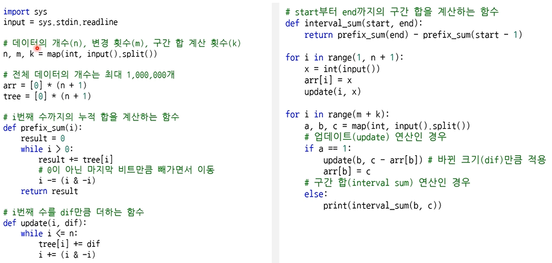

## 정렬 알고리즘
- 정렬: 데이터를 특정한 기준에 따라 순서대로 나열
- 데이터가 적거나, 많지만 데이터가 특정 범위로 한정되어있을때, 데이터가 이미 정렬되어 있는 경우 이러한 문제 상황에 따라서 적절한 정렬 알고리즘이 사용됨

### 선택 정렬
- 처리되지 않은 데이터 중에서 가장 작은 데이터를 선택해 맨 앞에 있는 데이터와 바꾸는 것을 반복
- 동작 예시
  1. 가장 작은 값을 골라 가장 앞의 데이터와 바꿔줌
  2. 처리되지 않은 데이터 중 가장 작은 값을 선택해 처리되지 않은 데이터의 가장 앞의 데이터와 바꿈
  3. 이러한 과정을 반복하면 순서대로 정렬됨
- 이중 반복문을 이용해서 작성
  - 파이썬에서는 한줄형식인 스와프 형식으로 표현할 수 있다는 것이 특징

    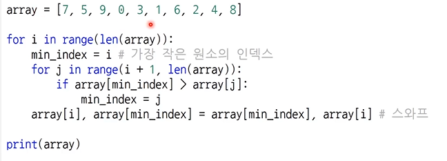

- 시간복잡도는 빅오 표기법을 따름 -> $O(N^2)$

### 삽입 정렬
- 처리되지 않은 데이터를 하나씩 골라 적절한 위치에 삽입
- 선택 정렬에 비해 구현 난이도가 높지만, 일반적으로 더 효율적으로 동작함
- 동작 예시
  1. 처리하지 않은 데이터중 가장 왼쪽값과 오른쪽 값의 크기를 비교해서 위치를 정함
  2. 위치를 정한뒤 다음데이터를 기준으로 어디에 들어갈지 처리한 데이터들과 비교를 해서 위치를 바꿔감
  1. 가장 작은 

    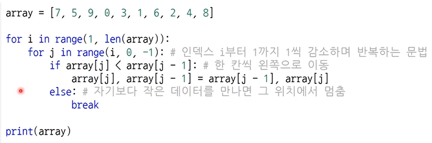

- 시간복잡도는 -> $O(N^2)$
  - 그러나 최선의 경우 -> $O(N)$의 시간 복잡도를 가짐
  (예시) 이미 정렬이 다 되어 있는 데이터

### 퀵 정렬
기준 데이터를 설정하고 그 기준보다 큰 데이터와 작은 데이터의 위치를 바꾸는 방법
- 일반적인 상황에서 가장 많이 사용
- 병합 정렬과 더불어 대부분의 프로그래밍 언어의 정렬 라이브러리의 근간이 되는 알고리즘
- 가장 기본적인 퀵 정렬은 첫 번째 데이터를 기준 데이터(Pivot)로 설정
  - 동작 예시
    1. 피벗의 값을 설정해 왼쪽에서부터 피벗보다 큰 데이터를 고르고 오른쪽에서 부터는 피벗보다 작은 데이터를 선택. 
    2. 선택된 큰값과 작은 값의 위치를 바꿔줌
    3. 마찬가지로 피벗값보다 더 큰데이터를 구하고 작은 데이터를 선택해 위치를 바꿔줌
    4. 이러한 과정을 반복
    5. 어느순간 큰 값과 작은값의 데이터가 엇갈릴 경우 피벗의 값과 작은 값의 위치를 바꿔줌
    

    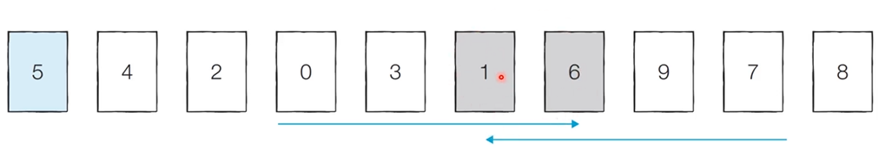
    

    6. 피벗값위 위치가 정해진뒤 피벗값을 기준으로 왼쪽 데이터 묶음 정렬과 오른쪽 데이터 묶음 정렬 각각에서 위와 같은 과정을 반복 
    7. 이러한 과정을 재귀적으로 수행하면 전체데이터가 정렬됨
- 퀵 정렬이 빠른 이유: 이상적인 경우 분할이 절반씩 일어난다면 전체 연산 횟수로 $O(NlogN)$를 기대할 수 있음
  - 그러나 최악의 경우 $O(N^2)$의 시간 복잡도를 가짐
  - 피벗값의 설정을 잘못하면 한쪽 방향으로 편향된 과정을 수행할 수 있음

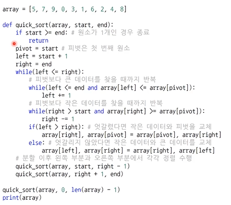

### 계수 정렬
특정한 조건이 부합할 때만 사용할수 있지만 매우 빠르게 동작하는 정렬 알고리즘
- 데이터의 크기 범위가 제한되어 정수 형태로 표현할 수 있을 때 사용
- 최악의 경우에도 수행 시간 $O(N+K)$를 보장
- 동작 예시
  1. 가장 작은 데이터부터 가장 큰 데이터까지의 범위가 모두 담길 수 있도록 리스트 생성
  2. 데이터를 하나씩 확인하며 데이터의 값과 동일한 인덱스의 데이터를 하나씩 증가
  3. 결과적으로 모든 데이터에 대해 완료했을때 각 데이터가 몇 번씩 등장했는지 횟수가 기록됨
  4. 결과를 확인할 때는 리스트의 첫 번째 데이터부터 하나씩 그 값만큼 반복하여 인덱스를 출력
    

        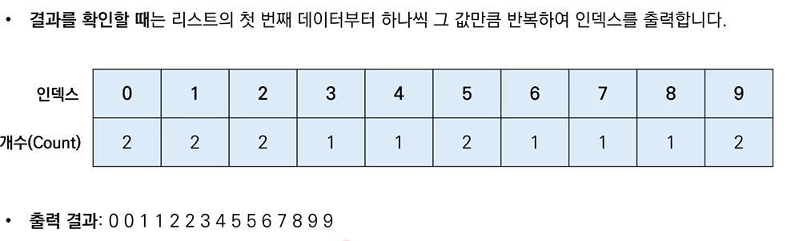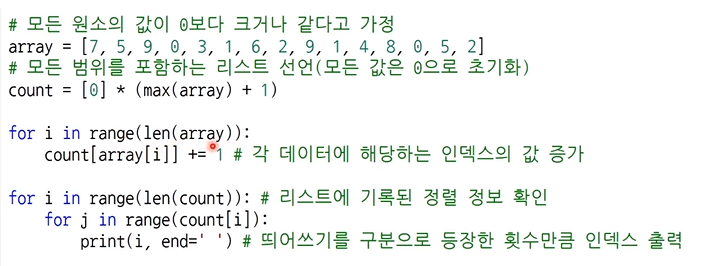
    

- 때에 따라 심각한 비효율성을 초래함   
(예시) 데이터가 0과 999,999로 단 2개만 존재하더라도 백만개 원소가 담길 배열을 생성해야함
> 즉, 계수 정렬의 경우 동일한 값을 가지는 데이터가 여러 개 등장할 때 효과적으로 사용할 수 있음

## 정리

        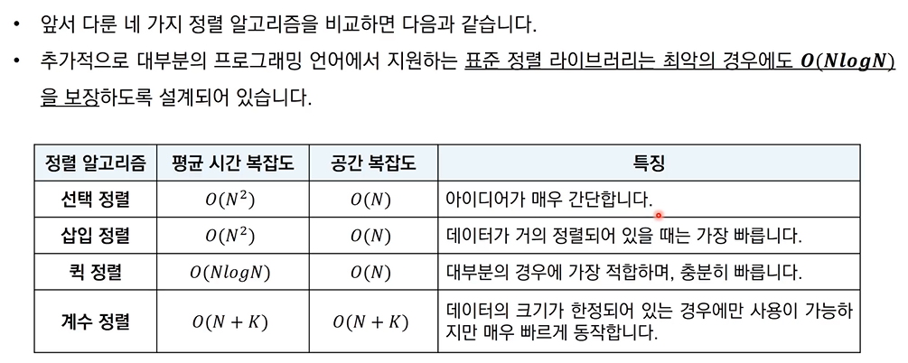

- 문제를 풀때 되도록 최악의 경우 $O(NlogN)$을 보장하는 정렬 알고리즘을 이용해야함

## DFS(Depth-First Search)
깊이 우선 탐색이라고도 부르며 그래프에서 깊은 부분을 우선적으로 탐색함
- 스택 자료구조(혹은 재귀 함수)를 이용
- 동작 과정
  1. 탐색 시작 노드를 스택에 삽입하고 방문 처리를 함
  2. 스택의 최상단 노드에 방문하지 않은 인접한 노드가 하나라도 있으면 그 노드를 스택에 넣고 방문처리함. 방문하지 않은 인접 노드가 없으면 스택에서 최상단 노드를 꺼냄
  3. 더 이상 2번의 과정을 수행할 수 없을 때까지 반복함
    - 인접한 노드가 여러개인 경우 방문기준은 문제가 제공해줄때도 있고 어떤 노드부터 방문하더라도 상관 없는 경우도 있음 

    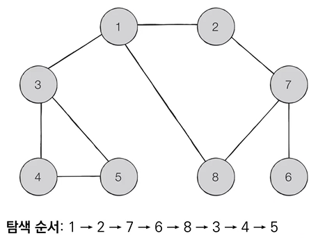 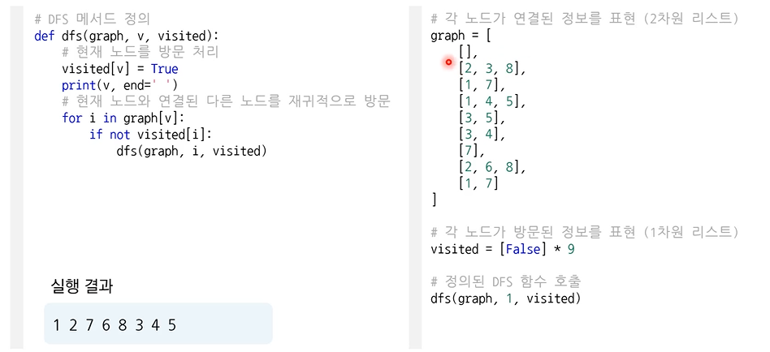

## BFS(Breadth-First Search)
BFS는 너비 우선 탐색이라고 부르며, 그래프에서 가까운 노드부터 우선적으로 탐색하는 알고리즘
- 큐 자료구조를 이용
- 동작 과정
  1. 탐색 시작 노드를 큐에 삽입하고 방문 처리를 함
  2. 큐에서 노드를 꺼낸 뒤에 해당 노드의 인접 노드 중에서 방문하지 않은 노드를 모두 큐에 삽입하고 방문처리함
  3. 더 이상 3번의 과정을 수행할 수 없을 때까지 반복함
  - 너비 우선으로 시작 노드부터 가까운 노드부터 차례대로 방문함
  - DFS와 마찬가지로 인접한 노드가 여러개인 경우 방문기준은 문제가 제공해줄때도 있고 어떤 노드부터 방문하더라도 상관 없는 경우도 있음 

    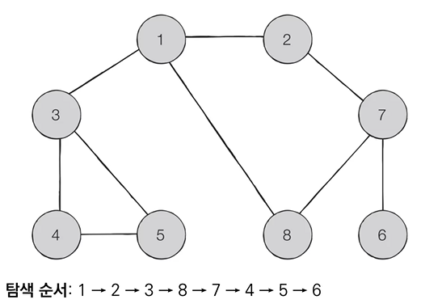 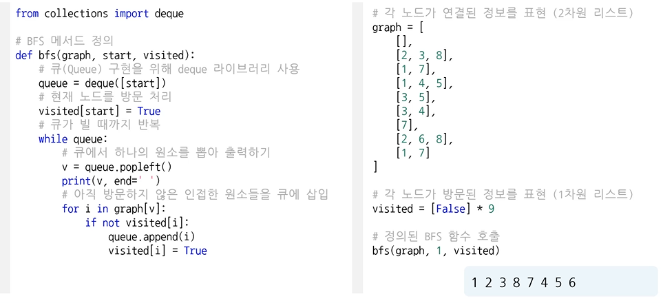

